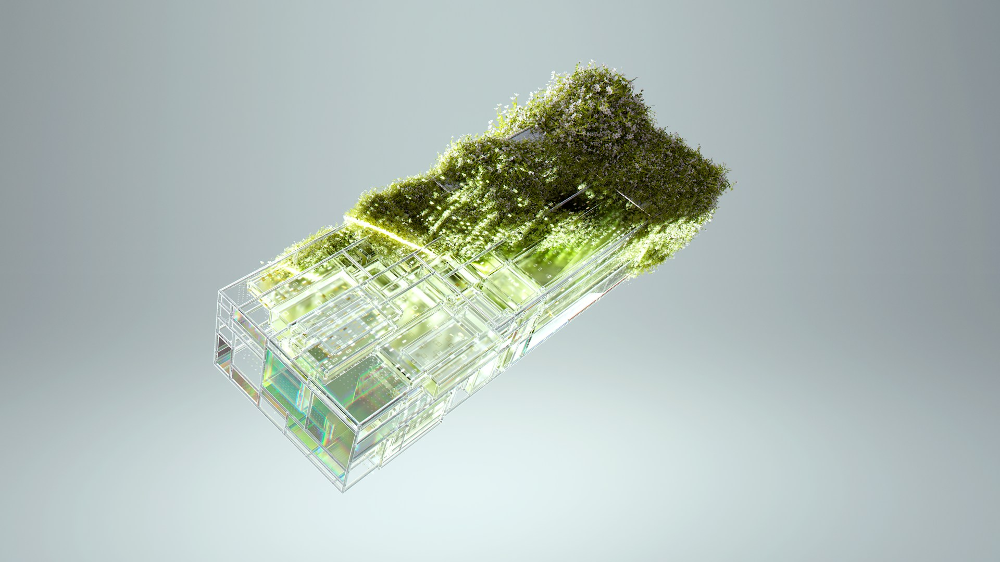

# Personal Website Built with Quarto

Welcome to my personal website! This site was built using [Quarto](https://quarto.org/),
a modern and flexible platform for creating interactive and data-driven
documents.

## Overview

This website serves as a platform for showcasing my portfolio, sharing my
thoughts and experiences through blog posts, and providing information about my
skills and projects. It is designed to be user-friendly, visually appealing, and
accessible across various devices.

## Features

- **About:** Learn more about my background, skills, and interests.
- **Blog:** Read my latest articles, tutorials, and insights on various topics.
- **Misc:** Various finished (and unfinished) projects.

## Technologies Used

- **Quarto:** Used as the primary framework for building the website.
- **Markdown:** Writing content for blog posts and project descriptions.

## Contributing

Contributions to improve the website are welcome! If you find any issues or have
suggestions for enhancements, please open an issue or submit a pull request.

## License

This project is licensed under the GPL v3 License - see the [LICENSE](LICENSE)
file for details.

## Contact

Feel free to reach out to me if you have any questions or feedback:

- [Email](mailto:guillaumegilles@me.com)
- [LinkedIn](https://www.linkedin.com/in/guillaumegilles/)

Thank you for visiting my website! 🚀

> [!note]
>
> ### To Do
>
> 1. [ ] Built website with **mobile focus**
> 2. [ ] RSS feed
> 3. [ ] [annotate beside](https://docs.github.com/en/actions/publishing-packages/publishing-docker-images) + peut-on trouver la solution, ici : https://quarto.org/docs/authoring/code-annotation.html
> 4. [ ] how to cite this blog posts
> 5. [ ] illustrated notes: https://www.lemonde.fr/sciences/visuel/2024/07/09/ariane-6-une-nouvelle-fusee-pour-l-europe_6248203_1650684.html
> 6. [ ] Adding footer.svg
> 7. [ ] add font : Nerdfont, IBM Plex Mono, Github Monospace
> 8. Challenges: Créer un repo pour les challenges avec une page quarto style blog pour les regrouper: cryptohack, leetcode
