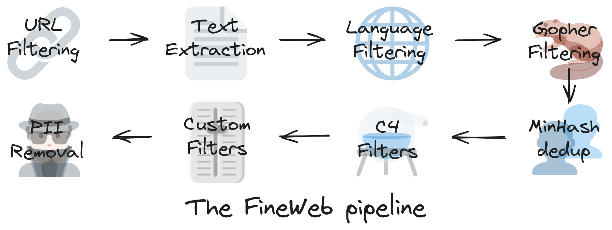

Generative AI’s meteoric rise, took over in 2022 with GPT3 released. After a few years and thousand of developper hours and fairly eas to implement and tap into OpenAI models to leverage generative AI superpower. Une 20aine ligne de code plus tard...

```{python}
#| code-fold: true

# Install the OpenAI Python library
pip install openai

#import openai packages
from openai import OpenAI
import os

# Authentication with API key
OPENAI_API_KEY = "ChallengeACPR"
openai.api_key = os.getenv("OPENAI_API_KEY")

# First step: defining a function
def get_response_to_prompt(prompt):
    response = openai.ChatCompletion.create(
    model = "gpt-4",
    message = [{"role": "user", "content":prompt}],
    temperature = 0.7
    )
    return response.choices[O].message["content"]

# Second step: prompting
prompt = """
Classify the text below, delimited by three dashes (-), as having either a positive or negative sentiment.

---
<text>
---
"""

# Last, but not least: printing the LLM completion
response = get_response_to_prompt
print(response)
```


- [State of GPT](https://www.youtube.com/watch?v=bZQun8Y4L2A)
- [OpenAI Documentation](https://platform.openai.com/docs/overview)
- [Cookbook](https://cookbook.openai.com/)
- [Get up and running with the OpenAI API](https://platform.openai.com/docs/quickstart?context=python)


## OpenAI GPT

The Generative Pre-trained Transformer (GPT) model was developed by [OpenAI](https://openai.com/) in 2018. It uses a 12-layer [transformer](../ai-milestones/index.qmd#transformer) decoder with a [self-attention layer](../transformer-architecture/index.qmd#self-attention-layer). It was trained on the BookCorpus dataset, which holds over 11,000 free novels. A notable feature of GPT-1
is the ability to do [[zero-shot-learning]].

Learned from tons of unlabelled text. Learning by being immerse in it.
No text book [@barektainFoundationalLargeLanguage2024].

- [State of GPT](https://www.youtube.com/watch?v=bZQun8Y4L2A) - Learn about the training pipeline of GPT assistants like ChatGPT
- https://openai.com/gpt-4
- https://openai.com/blog/chatgpt
- https://openai.com/research/gpt-4
- [GitHub](https://github.com/openai/gpt-3)
- [Language models are few-shot learners](https://openai.com/research/language-models-are-few-shot-learners)
- [Paper](https://arxiv.org/abs/2005.14165)

### GPT-2

GPT-2 succeded to GPT-1 and released in 2019. It is trained on a dataset 10 times larger than GPT-1 and using 1.5 billion parameters (compared to the 117 million parameters used on GPT-1).

### GPT-3

GPT-3 has a 96-layer neural network and 175 billion parameters and is trained using the 500-billion-word Common Crawl dataset. The popular ChatGPT chatbot is based on GPT-3.5.

Increasing [[few-shot-learning]]: learning a new skill by watching a quick demo [@barektainFoundationalLargeLanguage2024].

### GPT-4

And GPT-4, the latest version, launched in late 2022 and successfully passed the Uniform Bar Examination with a score of 297 (76%).

## Pre-training

Generative AI requires huge amount of data to process in order to gain knoxwledge. In case of text <inference> it needs ton high quality and diverse documents. Most often these documents comes from the Internet. [🍷 FineWeb](https://huggingface.co/spaces/HuggingFaceFW/blogpost-fineweb-v1) is a good example of dataset curated by generative Ai startups like Open AI, Anthropic, Mistral, etc...

Even thought, it's *only" 44TB worth of document

### Dataset foundation

[Common Crawl](https://commoncrawl.org/) data are free and open source repository of web pages (over 250 billion in the last 18 years)

Steps:



1. **URL Filtering**: website's contents that lower the quality and/or diversity of the dataset is removed by filtering out their URL at the very begging. Therefore crawlers do not even bother to visit these webpage and do not collect data on it. This kind of website are categorize in adult, malware, cryptojacking (i.e hijack your machine to mine crypto on the backend), etc...
2. **Text Extraction**: crawler collects raw pages, in markup languages: HTML, CSS, javascript.

```html
<p>Recently, we released <a href="https://huggingface.co/datasets/HuggingFaceFW/fineweb"><strong>🍷 FineWeb</strong></a>, a new, large-scale
        (<strong>15-trillion tokens, 44TB disk space</strong>) dataset for LLM pretraining. FineWeb is derived from 96 <a href="https://commoncrawl.org/">CommonCrawl</a> snapshots and produces <strong>better-performing LLMs than other open pretraining datasets</strong>. To bring more clarity in machine learning and advance the open understanding of how to train good quality large language models, we carefully documented and ablated all of the design choices used in FineWeb, including in-depth investigations of deduplication and filtering strategies. The present long form report is a deep dive in how to create a large and high-quality web-scale dataset for LLM pretraining. The dataset itself, 🍷 FineWeb, is available <a href="https://huggingface.co/datasets/HuggingFaceFW/fineweb">here</a>.
        </p>
```

Therefore we need to extract only text

3. **Language Filtering**:
4. **Gopher Filtering**:
5. **PII removal**: identifies and delete personal information
6. **Custom Filters**:
7. **C4 Filters**:
8. ** MinHash dedup**:

## Tokenization

Neulral Network requires a one dimensional sequence of symbols with a finite numbers of possible symbols. Therefore we need to transform our latin alphabet that we use, as human, to communicate into symbols that computer can understand and work with.

## Ressources

1. [Deep Dive into LLMs like ChatGPT](https://www.youtube.com/watch?v=7xTGNNLPyMI)
