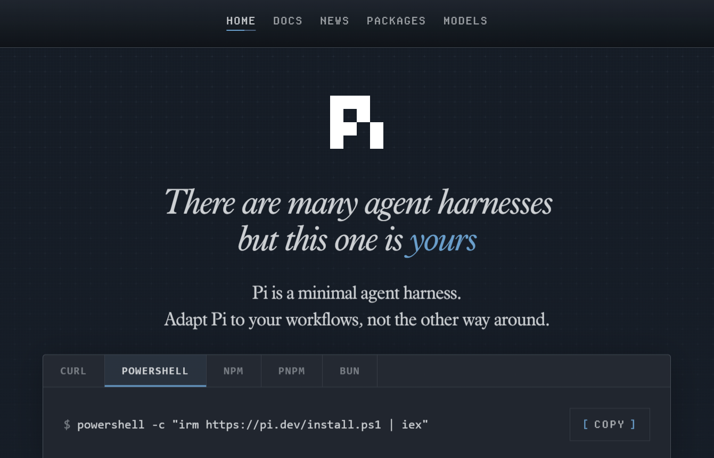

Software development offers a striking illustration of the speed at which
generative AI has evolved and been adopted. Developers were instrumental in
building and advancing this technological revolution, but they are also among
the first to experience its disruptive effects.

Within only a few years, AI systems have progressed from simple coding
assistants to increasingly autonomous agents capable of planning, writing,
testing, and modifying code with limited human oversight.

Agentic coding does not eliminate software engineering, but rather moves
engineering effort from writing code to designing the environment in which
implementations can be produced, tested, and trusted.

> What happens when AI progresses from suggesting code to controlling
increasingly large portions of the development process?

## From Assistance to Collaboration

The evolution of AI-assisted development can be understood as a gradual transfer
of control, from individual lines of code to complete software-production
workflows.

### A New Paradigm

A new paradigm, in which developers express *what* they want to build rather
than *how* to build it, has emerged. Rather than following a strict
chronological eras that replace one after another, we should think as
**different levels of abstraction**. Autocomplete, chat, synchronous agents,
background agents, and autonomous workflows continue to coexist and varies
accros industries.

### Level 1: Autocompletion

The first generation was autocomplete. Tools, like [Github Copilot in 2021](https://github.blog/news-insights/product-news/introducing-github-copilot-ai-pair-programmer/),
predicted the next line, filled in boilerplate, and saved keystrokes on
repetitive patterns.

Even though the feature is useful and genuinely time-saving, the workflow stayed
identical. Software engineers wrote code, ran it, debug, and repeat. AI tool
assisted by reducing friction.

{width=200}

> At this level, AI accelerates typing, but it does not control the development
process.

### Level 2: Collaboration

The second generation introduced synchronous AI assistants. You described a task in
natural language, and the model generated code in response. As [Andrej Karpathy](https://karpathy.ai/)
famously wrote in January 2023:

> “The hottest new programming language is English.”

This phrase perfectly captures an era defined by a continuous back-and-forth
between a developer and a generative AI chatbot. The model generated an initial
version of the code, which you then reviewed, corrected, and refined through
successive prompts until you reached a working result.

This represented another step up the delegation stack. Compared with the previous
generation, the developer spent less time writing code directly and more time
describing their intent. However, human involvement was still required at every
stage. The AI acted as a collaborator, not as an autonomous worker. You retained
the overall context, decided what should happen next, and identified mistakes as
they occurred.

<blockquote class="twitter-tweet" data-lang="en" data-theme="dark"><p lang="en" dir="ltr">The hottest new programming language is English</p>&mdash; Andrej Karpathy (@karpathy) <a href="https://x.com/karpathy/status/1617979122625712128?ref_src=twsrc%5Etfw">January 24, 2023</a></blockquote> <script async src="https://platform.x.com/widgets.js" charset="utf-8"></script>

> The AI is a collaborator, not an autonomous worker. It can propose an
implementation, but the developer still holds the overall context and directs
each successive action.

## Vibe Coding as a Transitional Stage

### What is Vibe Coding

Two years after declaring English to be the “hottest new programming language”,
Andrej Karpathy coined the term **vibe coding**. He described it as a way of
programming in which you “fully give in to the vibes, embrace exponentials, and
forget that the code even exists.”

<blockquote class="twitter-tweet" data-theme="dark"><p lang="en" dir="ltr">There&#39;s a new kind of coding I call &quot;vibe coding&quot;, where you fully give in to the vibes, embrace exponentials, and forget that the code even exists. It&#39;s possible because the LLMs (e.g. Cursor Composer w Sonnet) are getting too good. Also I just talk to Composer with SuperWhisper…</p>&mdash; Andrej Karpathy (@karpathy) <a href="https://x.com/karpathy/status/1886192184808149383?ref_src=twsrc%5Etfw">February 2, 2025</a></blockquote> <script async src="https://platform.x.com/widgets.js" charset="utf-8"></script>

Vibe coding reflects the growing capabilities of generative AI tools and their
expanding role in software development. In this approach, users express what
they want to build through natural-language prompts or speech, and an AI
system translates those instructions into executable code. Rather than focusing
on syntax or implementation details, the user concentrates on the desired
outcome and guides the system through successive iterations.

However, vibe coding is more than simply using an AI coding assistant. It
requires trust in the model and interaction with the resulting software.
Therefore, rather than understanding its source code, you primarily engage
with it like a final users would have. This conversational cycle continues
until the application appears to work as intended.

By prioritising experimentation over immediate improvements to structure and
performance, vibe coding adopts a “build first, refine later” mindset. It can
therefore support rapid prototyping, iterative development, and short feedback
loops. These qualities are broadly consistent with agile development practices,
as they allow developers to test ideas and produce prototypes quickly.

Speed comes with a trade-off. When users accept generated code without fully
reviewing or understanding it, they may accumulate technical debt, introduce
hidden vulnerabilities, or create systems that become difficult to maintain.
Vibe coding can accelerate the production of a working prototype, but it does
not eliminate the need for software engineering discipline.

## From Collaboration to Delegation

### Level 3: Delegation

The third generation marks the shift from collaboration to delegation. Instead
of guiding the AI step by step, the developer defines an outcome and allows an
**autonomous agent** to manage the workflow.

The agent can inspect a repository, plan changes, modify multiple files, install
dependencies, run tests, diagnose failures, and submit a pull request. It may
work independently for minutes or hours while the developer focuses on other tasks.

The level of abstraction is no longer a line of code or a prompt, but an entire
task. Human involvement moves from continuous direction to asynchronous
supervision: the agent executes the work, while the developer sets the
constraints, reviews the results, and remains accountable for the final
decision.

<blockquote class="twitter-tweet" data-lang="en" data-dnt="true" data-theme="dark"><p lang="zxx" dir="ltr"><a href="https://t.co/jZKOk8RAsV">https://t.co/jZKOk8RAsV</a></p>&mdash; Michael Truell (@mntruell) <a href="https://x.com/mntruell/status/2026736314272591924?ref_src=twsrc%5Etfw">February 25, 2026</a></blockquote> <script async src="https://platform.x.com/widgets.js" charset="utf-8"></script>

## From Delegation to Orchestration

### Level 4: Orchestration

A fourth level is now emerging: **orchestration**. Instead of delegating an
entire task to a single agent, a human or coordinating system divides the work
among multiple specialised agents, manages dependencies, and routes their outputs
through testing and verification.

At this level, the developer no longer supervises individual tasks but oversees
a system of agents working together. The focus shifts from directing execution
to designing workflows, setting boundaries, and defining how results will be
evaluated.

> Autonomy is not binary. It is the gradual transfer of control over increasingly
large portions of the development loop.

## The Factory and Its Operator

To continue the metaphor of AI agent as a digital worker, real world factories
builds cars, appliances, etc. Over the last couple of centuries they have
refined the production of goods to mostly automate the production lines.

### The factory is the system

The factory model offers a useful metaphor to understand this transformation.
As AI takes over more of the implementation process, the developer’s primary
output is no longer just code. It is the system that reliably produces code.

That system combines clear specifications, relevant context, capable agents,
automated tests, quality gates, and feedback loops. Agents generate the
implementation, tests expose failures, and those failures are fed back into the
system for correction. Guardrails define what agents can change, which tools
they can use, and when human approval is required.

In this model, the developer resembles the architect of an assembly line rather
than a worker at a single station. Their role is to design the workflow,
establish quality standards, and ensure that errors are detected before they
reach production.

The central skill is therefore no longer describing every step. It is defining
the desired outcome, setting clear constraints, and creating reliable ways to
verify the result. The better the production system, the less human intervention
each individual task requires.

> The developer does not merely produce code. They design the system through
which code is produced, tested, corrected, and approved.

```{mermaid}
%%| label: fig-factory-model
%%| fig-cap: "The Factory Model — Developer designs the system, agents produce the code, tests verify the output"
flowchart TD
    Dev["👨‍💻 Developer\n(Factory Manager)"]

    subgraph Factory["🏭 The Factory"]
        direction TB
        Spec["📋 Specifications\n& Context"] --> Agents["🤖 AI Agents\n(Implementation)"]
        Agents --> Tests["✅ Tests\n& Quality Gates"]
        Tests --> FL["🔄 Feedback\nLoops"]
        FL --> Agents
        GR["🛡️ Guardrails\n& Constraints"] --> Agents
    end

    Dev --> Factory
    Factory --> Code["📦 Production\nCode"]

    style Factory fill:#1a1a2e,stroke:#4a4a8a,color:#fff
    style Dev fill:#533483,stroke:#7a5ab5,color:#fff
    style Code fill:#1a3d1a,stroke:#4a8a4a,color:#fff
```

#### The Dark Factory

The **dark factory** mental model extends on the factory model to its logical,
but still emerging, conclusion. The term describes a fully automated facility
in which machines operate without human workers on the floor. Because no one
needs to see, the lights can be switched off. Applied to software development,
it represents a production system in which agents could receive objectives,
divide the work, write and test the code, correct failures, and deploy the result
without human intervention.

In such a system, developers would no longer supervise each task or approve
every pull request. Instead human judgment would be embedded in advance through
specifications, policies, quality thresholds, security controls, and escalation
rules. Agents would then operate the software factory continuously, involving
people only when they encountered a situation outside those predefined boundaries.

This is not yet another established level of agentic coding. It is an emerging
idea about where increasing autonomy might eventually lead. Today’s agents still
require human oversight, particularly when requirements are ambiguous, consequences
are significant, or correctness cannot be verified automatically. The dark factory
should therefore be understood not as the current state of software development,
but as its automation frontier.

The metaphor also exposes an important paradox: switching off the lights does
not remove human responsibility. It merely moves human involvement outside the
factory. People must still decide what the system should build, which
constraints it must respect, how success will be measured, and when production
should stop.

> The lights go out not because humans have disappeared, but because their
judgment has been encoded into the factory itself.


Think of an AI agent as a digital worker made up of five essential parts:

1. **The model is its brain.**

  > Usually powered by a [large language model](https://en.wikipedia.org/wiki/Large_language_model),
  it examines the situation, reasons about what to do next, and produces a thought,
  an action, or a response.

2. **Tools are its hands.**

> They allow the agent to act in the outside world by calling APIs, running
  code, searching databases, or asking other agents for help.

3. **Memory is its notebook.**

> It helps the agent remember previous interactions, retrieve project-specific
  instructions, and preserve useful information from one task or session to
  another.

4. **Orchestration is its nervous system.**

>  It coordinates the entire process: feeding information to the model
  activating the right tools, collecting their results, and deciding whether the
  agent should continue or stop.

5. **Deployment is its workplace.**

> It provides the infrastructure the agent needs to operate reliably in the real
  world, including hosting, identity management, monitoring, security, and
  production systems.


## Harness

- https://www.langchain.com/blog/the-anatomy-of-an-agent-harness
- https://www.datacamp.com/blog/agent-harness
- https://mitchellh.com/writing/my-ai-adoption-journey#step-5-engineer-the-harness
- https://lucumr.pocoo.org/2026/7/4/better-models-worse-tools/
  + https://simonwillison.net/2026/Jul/4/better-models-worse-tools/

----
We view harness engineering as a subset of context engineering. Coined by my cofounder Dex in 12-factor agents, context engineering is a superset of “prompt engineering” and a variety of other techniques for systematically improving AI agents’ reliability. You can find the original talk on here.

Harness engineering then is the subset of context engineering which primarily involves leveraging harness configuration points to carefully manage the context windows of coding agents.
https://www.humanlayer.dev/blog/skill-issue-harness-engineering-for-coding-agents
----


## Harness Engineering: What Surrounds the Model

There is a temptation to treat the model as the system. A new model comes out, the
agent gets smarter. That intuition is wrong, and it leads to the wrong investments.

**A raw model is not an agent.** It becomes one once a harness gives it state,
tool execution, feedback loops, and enforceable constraints. The behaviour
developers experience when working with Claude Code, Cursor, Codex, Aider, or
Cline is dominated by what the harness does, not just by which model is
underneath.

$$\text{Agent} = \text{Model} + \text{Harness}$$

```{mermaid}
%%| label: fig-harness-anatomy
%%| fig-cap: "Harness Anatomy — Agent = Model + Harness"
flowchart TB
    subgraph Harness["🔧 The Harness"]
        direction TB
        IR["📜 Instructions &\nRule Files\n(AGENTS.md, CLAUDE.md)"]
        Tools["🛠️ Tools\n(APIs, MCP Servers)"]
        Sandbox["📦 Sandboxes &\nExecution Environments"]
        Orch["🔀 Orchestration Logic\n(Sub-agents, routing)"]
        GR["🛡️ Guardrails / Hooks\n(Lifecycle checkpoints)"]
        Obs["📊 Observability\n(Logs, traces, evals)"]
    end

    Model["🧠 Model\n(Reasoning Engine)"] --> Harness
    Harness --> Agent["🤖 Agent\n(Working System)"]

    style Harness fill:#1a1a2e,stroke:#4a4a8a,color:#fff
    style Model fill:#533483,stroke:#7a5ab5,color:#fff
    style Agent fill:#1a3d1a,stroke:#4a8a4a,color:#fff
```

### What's in the Harness

- **Instructions and Rule Files** — the text that defines who the agent is, what
  it cares about, and what it is forbidden from doing. Includes `AGENTS.md`,
  `CLAUDE.md`, `GEMINI.md`, skill files, and sub-agent prompts.
- **Tools** — the functions, MCP servers, and APIs the agent can call, plus the
  prose that tells the model when and how to call them.
- **Sandboxes and execution environments** — where the agent's code actually
  runs, what it has access to, what it cannot reach.
- **Orchestration logic** — sub-agent spawning, model routing, hand-offs between
  specialists, and the rules that govern when each fires.
- **Guardrails / Hooks** — deterministic code that runs at specific lifecycle
  points: before a tool call, after a file edit, before a commit. Hooks are the
  place for things the agent should never forget but often does.
- **Observability** — logs, traces, evaluations, cost and latency metering.
  Without observability, there is no way to tell whether the agent is doing well
  or quietly drifting.

### Harness in SDLC

```{mermaid}
%%| label: fig-harness-sdlc
%%| fig-cap: "The Harness Across SDLC Phases"
flowchart LR
    subgraph P1["Phase 1\nRequirements & Architecture"]
        H1["⚙️ Configure\nInstruction files,\ntool access, rules"]
    end
    subgraph P2["Phase 2\nImplementation"]
        H2["▶️ Run\nSandboxes,\nexecution environments,\ntools"]
    end
    subgraph P3["Phase 3\nTesting & QA"]
        H3["🔄 Feedback Loop\nOrchestration logic,\nguardrails → self-correction"]
    end
    subgraph P4["Phase 4\nReview, Deploy & Maintain"]
        H4["👁️ Observe\nHooks, observability,\naudit trails"]
    end
    P1 --> P2 --> P3 --> P4

    style P1 fill:#1a2a3d,stroke:#4a6a8a,color:#fff
    style P2 fill:#1a3d1a,stroke:#4a8a4a,color:#fff
    style P3 fill:#3d2a1a,stroke:#8a6a4a,color:#fff
    style P4 fill:#2d1a3d,stroke:#6a4a8a,color:#fff
```

::: {.callout-important}
## Most Agent Failures are Configuration Failures
When an agent does something wrong, the first instinct is to blame the model.
More often, the failure traces back to a missing tool, a vague rule, an absent
guardrail, or a context window stuffed with noise. Public benchmarks confirm
this: one team moved a coding agent from outside the Top 30 to the Top 5 on
Terminal Bench 2.0 by changing **only the harness**, with no model change at all.
:::

1. Requirements, Planning, & Architecture (Configuring
the Harness)
This is where the harness is configured and calibrated. Before the AI writes any production
code, the developer must set up the agent's environment.
• Harness Configuration: Providing the Instructions and Rule Files (e.g., creating the
AGENTS.md and defining architectural constraints) that the harness will load and make
available to the model.
• The Action: The developer defines the tools the agent will have access to (like specific
APIs or database schemas) and sets the fundamental rules the agent cannot break.
2. Implementation (Running the Harness)
During active coding, the harness acts as the boundary that keeps the AI model focused,
secure, and productive.
• Harness Components Used: Sandboxes, Execution Environments, and Tools.
The Action: As the model generates code, it executes it within the harness's isolated
sandbox. If the model needs to read a file or search the web, it uses the tools provided
by the harness.
3. Testing & QA (The Feedback Loop)
Testing in an agentic workflow relies heavily on the harness to facilitate
autonomous self-correction.
• Harness Components Used: Orchestration Logic and Guardrails.
• The Action: When the agent writes a function, the harness provides the execution
environment (such as a sandboxed terminal) that allows the automated tests to be
executed. If a test fails, the orchestration logic captures the error output from that
environment and routes it back to the model, asking it to try again. The harness is what
creates this automated 'think -> act -> observe' loop."
4. Code Review, Deployment, & Maintenance (Observing
the Harness)
Even after the code is written, the harness ensures the agent behaves safely in live or
near-live environments.
• Harness Components Used: Hooks and Observability.
• The Action: The harness runs deterministic hooks (e.g., blocking a commit if the agent
tries to push a hard-coded password). Furthermore, the observability layer tracks token
costs, latency, and agent drift, allowing human engineers to audit exactly why an agent
made a specific deployment decision.
The transition from 'vibe coding' to 'agentic engineering' is not simply about the tools you
use—a developer can vibe code or apply agentic engineering using the exact same agent.
Instead, it is defined by how deliberately you configure and apply the harness. Vibe coding
relies on minimal or implicit scaffolding aimed purely at rapid implementation. Agentic
engineering relies on clear, extensive harness abstractions that guide the AI from the very
first planning document all the way through to production monitoring.
The impact of this deliberate configuration is highly measurable. Public benchmarks make the
size of the harness effect concrete. On Terminal Bench 2.0, one team moved a coding agent
from outside the Top 30 to the Top 5 by changing only the harness, with no model change at
all. A separate study at LangChain raised a coding agent's score on the same benchmark by
13.7 points by tweaking only the system prompt, tools, and middleware around a fixed model.
The everyday version of this observation is crucial for teams adopting AI across the SDLC:
when an agent does something wrong, the first instinct is to blame the model. More often,
the failure traces back to a missing tool, a vague rule, an absent guardrail, or a context
window stuffed with noise. Most agent failures, examined honestly, are configuration failures.

---

## Agent Harness vs. RALPH Loop: Understanding the Architecture of Modern AI Agents

*Intro hint:*
Explain the confusion: people often mix “how an agent runs” vs “how an agent thinks.” Introduce both terms and why the distinction matters for anyone building or studying agentic systems.

### Why This Distinction Matters

*Hint:*
Briefly explain that modern AI systems are no longer just prompts—they are structured systems. Emphasize that understanding the difference helps in designing, debugging, and scaling agents.

## What Is an Agent Harness?



### A Practical Definition

*Hint:*
Define the harness as the environment/runtime that enables an agent to operate (tools, execution, memory, constraints).

### Core Components of an Agent Harness

*Hint:*
List and briefly orient the reader on:

* Tooling (APIs, code execution, browsing)
* Memory (state, logs, persistence)
* Control system (loop orchestration)
* Observability (logs, traces)
* Safety/guardrails

### Mental Model: The “Body” of the Agent

*Hint:*
Use analogy: harness = body/environment, agent = brain. Helps anchor intuition.

## What Is a ReAct / RALPH Loop?

### The Core Idea: Iterative Reasoning

*Hint:*
Explain that loops define how the agent cycles through thinking and acting.

### The ReAct Loop (Reason + Act)

*Hint:*
Introduce the canonical loop:
Observe → Think → Act → Observe → repeat
Mention it’s the foundation of many modern agents.

### The RALPH Loop (An Extended Reasoning Pattern)

*Hint:*
Explain it as a richer variant (Reason, Act, Learn, Plan, Hypothesize).
Highlight that it introduces planning and learning steps.

### Mental Model: The “Cognitive Cycle”

*Hint:*
Frame loops as the agent’s internal thinking process—like a decision-making rhythm.

## How They Work Together

### The Key Relationship

*Hint:*
State clearly:

> The loop runs inside the harness
> One is *behavior*, the other is *infrastructure*

### Putting It Together in a Real System

*Hint:*
Describe a concrete example (e.g., coding agent, research agent).
Separate:

* what the harness provides
* how the loop drives actions

### Common Confusion (and Why It Happens)

*Hint:*
Explain that frameworks blur the line because they bundle both (e.g., LangChain, AutoGen).

## From Theory to Practice

### Frameworks as Agent Harnesses

*Hint:*
Mention modern tools that implement harnesses (without going too deep): orchestration frameworks, agent platforms.

### Research as Loop Innovation

*Hint:*
Position research work (ReAct, reflection loops, planning methods) as improvements to reasoning patterns—not the infrastructure.

## Final Takeaway

### The One-Sentence Distinction

*Hint:*
Give a crisp takeaway:

> Agent harness = where the agent runs
> Loop (ReAct / RALPH) = how the agent thinks

### Why This Will Matter Increasingly

*Hint:*
Brief forward-looking note: as agents get more autonomous, separating system design (harness) from cognition (loop) will be critical.


## Practical Patterns

1. Agent-first drafts with tight iteration loops

  Don’t use AI for one-off suggestions. Generate entire first drafts, then
  refine. The Claude Code team practice: have the model review its own code
  with a fresh context window. This catches issues before human review.

2. Declarative communication

  Spend 70% of effort on problem definition, 30% on execution. Write
  comprehensive specs, define success criteria, provide test cases up front.
  Guide the agent’s goals, not its methods.

3. Automated verification

  If you repeatedly fix the same class of mistake, write a test or lint rule
  preemptively. Make the agent explain its code and flag potential problems
  before you review.


### The Pareto Law

= https://addyo.substack.com/p/the-80-problem-in-agentic-coding

Andrej Karpathy Twitter / X

= Boris Cherney :
> “Pretty much 100% of our code is written by Claude Code + Opus 4.5. For me
> personally it has been 100% for two+ months now, I don’t even make small edits
> by hand. I shipped 22 PRs yesterday and 27 the day before, each one 100%
> written by Claude. I think most of the industry will see similar stats in the
> coming months - it will take more time for some vs others.”


...WIP...

Let AI do 80% of the work and focus your energy on the 20% left.

The 80% Problem

A persistent challenge: AI agents can rapidly generate approximately **80% of
the code** for a feature, but the remaining 20% — edge cases, error handling,
integration points, and subtle correctness requirements — demands deep contextual
knowledge that current models often lack.

The nature of AI errors has evolved from simple syntax mistakes to more insidious
**conceptual failures**: wrong assumptions about business logic, missing edge
cases, and architectural decisions that create subtle long-term maintenance
burdens. These errors are harder to detect because the code "looks right" and may
even pass basic tests.

::: {.callout-tip}
The developers who navigate this challenge most effectively use AI for what it's
good at (rapid implementation of well-specified tasks) while reserving their own
attention for what AI struggles with (ambiguous requirements, architectural
trade-offs, and correctness verification).
:::

## Where to Start

::: {.panel-tabset}
### For Individual Developers

1. **Set up an `AGENTS.md`** for the project. Start with ten lines: stack,
   conventions, hard rules, workflow. Add a rule every time the agent does
   something it should not do again.

2. **Install a set of skills** for your coding agents (like Agents CLI) to build,
   evaluate, deploy and optimize agents.

3. **Pick one repetitive workflow and make it the first agent.** A research
   workflow, a code review process, a recurring report. Use a coding agent for
   the prototype, graduate it to a production agent when it earns its keep.
   Building one agent end to end teaches more than reading about a hundred.

4. **Write the tests and evals before generating the code.** Together they are
   the contract with the AI. A well-written test and eval suite communicates
   intent more precisely than any natural-language prompt, and turns AI-assisted
   development from vibe coding into agentic engineering.

5. **Review every line the agent produces that is going to ship.** Be skeptical
   of anything that looks clever. Check imports for real packages. Verify that
   error handling covers realistic failure modes.

6. **Maintain your developer skills.** AI handles the routine so the developer
   can focus on the challenging. That arrangement only works if foundational
   skills — debugging, system design, intuition for performance and correctness
   — stay sharp.

### For Engineering Leaders

1. **Make context engineering a first-class engineering practice.** Treat
   `AGENTS.md`, system prompts, eval suites, and skill libraries as code:
   reviewed in pull requests, versioned with the project, owned by named
   engineers.

2. **Set the bar at the eval, not the demo.** A working demo proves an agent can
   succeed once. A passing eval suite proves it succeeds reliably. Define what
   you are scoring: task success, tool use quality, trajectory compliance,
   hallucination, and response quality.

3. **Re-shape code review for AI-generated code.** Extra attention to
   hallucinated dependencies, inadequate error handling, and subtle correctness
   gaps that look right at a glance.

4. **Distinguish prototyping work from production work in team norms.** Vibe
   coding is the right speed for exploration. Agentic engineering is the right
   discipline for production. Make the boundary explicit.

5. **Invest in harness components as a shared team asset.** Reusable system
   prompts, skill libraries, MCP server connections, and evaluation harnesses
   compound across projects. Treat them as infrastructure.

### For Organizations

1. **Treat AI-assisted development as an engineering investment, not a
   productivity feature.** Rolling out a coding agent without eval coverage,
   observability, and clear architectural standards produces speed without
   quality.

2. **Invest in the production substrate before scale.** What graduates a
   vibe-coded prototype to production is operations discipline: trajectory and
   final-response evals in CI, traces of every agent run, scoped permissions,
   and security review tuned to generated code's failure modes.

3. **Adopt open standards.** Model Context Protocol (MCP) for tool access and
   Agent2Agent (A2A) for cross-agent delegation are converging into the
   connective tissue of multi-agent systems.

4. **Plan for hybrid teams of humans and agents.** The strongest production
   results come from architectures where humans set direction, agents do the
   implementation, and clear handoff protocols govern the boundary.

5. **Reframe hiring and skill development around judgment, not just
   implementation.** The most valuable engineers in the next several years will
   be the ones who can direct agents well, not the ones who can write the most
   code.
:::


------- #######    TO REVIEW    ########----------------
    An AI agent is a software system that perceives a goal, plans steps to reach
    it, takes actions through tools, observes the results, and iterates until
    the goal is met or it hits a stopping condition. Where a chatbot produces a
    response and waits for the next prompt, an agent runs its own loop. You give
    it a goal at the top, then it decides what to do next at each step.


## References

The Factory Model: How Coding Agents Changed Software Engineering
 = https://addyosmani.com/blog/factory-model/
The third golden age of software engineering – thanks to AI, with Grady Booch
 = https://newsletter.pragmaticengineer.com/p/the-third-golden-age-of-software
5-Day AI Agents: Intensive Vibe Coding Course With Google
 = https://www.kaggle.com/learn-guide/5-day-agents-vibecoding

 ---
 ---

 ## The Spectrum: Vibe Coding to Agentic Engineering

 Rather than treating vibe coding and agentic engineering as a binary, it is more
 useful to think of them as endpoints on a spectrum. The key differentiator is not
 whether you use AI, it's **how much structure, verification, and human judgment
 surrounds the AI's output**.

 By early 2026, Karpathy, himself, acknowledged that the term _vibe coding_ was
 too narrow, introducing the term **"agentic engineering"** to describe the more
 disciplined end of the spectrum:

 <blockquote class="twitter-tweet" data-theme="dark"><p lang="en" dir="ltr">A lot of people quote tweeted this as 1 year anniversary of vibe coding. Some retrospective -<br><br>I&#39;ve had a Twitter account for 17 years now (omg) and I still can&#39;t predict my tweet engagement basically at all. This was a shower of thoughts throwaway tweet that I just fired off… <a href="https://t.co/yoJPmb1xuK">https://t.co/yoJPmb1xuK</a></p>&mdash; Andrej Karpathy (@karpathy) <a href="https://x.com/karpathy/status/2019137879310836075?ref_src=twsrc%5Etfw">February 4, 2026</a></blockquote> <script async src="https://platform.x.com/widgets.js" charset="utf-8"></script>

 ```{mermaid}
 %%| label: fig-spectrum
 %%| fig-cap: "The Vibe Coding to Agentic Engineering Spectrum"
 flowchart LR
     subgraph VC["🌊 Vibe Coding"]
         V1["Casual NL prompts"]
         V2["'Does it seem to work?'"]
         V3["Copy-paste errors to AI"]
         V4["Minimal code understanding"]
     end
     subgraph SAC["🔧 Structured AI-Assisted Coding"]
         S1["Detailed prompts with examples"]
         S2["Manual testing & spot-checking"]
         S3["Developer diagnoses root cause"]
         S4["Selective review of critical paths"]
     end
     subgraph AE["⚙️ Agentic Engineering"]
         A1["Formal specs, architecture docs"]
         A2["Automated test suites, CI/CD gates"]
         A3["Agents self-diagnose within bounds"]
         A4["Comprehensive architecture review"]
     end
     VC --> SAC --> AE

     style VC fill:#3d1a1a,stroke:#8a4a4a,color:#fff
     style SAC fill:#1a2a3d,stroke:#4a6a8a,color:#fff
     style AE fill:#1a3d1a,stroke:#4a8a4a,color:#fff
 ```

 ## Difference between [vibe coding](./vibe-coding.qmd) and agentic engineering

 The single biggest differentiator between the two ends is how outputs get
 verified. In vibe coding, verification is optional. In agentic engineering, two
 mechanisms work together:

 - **Tests** verify the deterministic parts: a function given this input produces
   that output.
 - **Evals** verify the non-deterministic parts: did the agent take the right
   trajectory, choose the right tools, and produce a response that meets the
   quality bar.

 Without both, the practice is always vibe coding, regardless of how
 sophisticated the prompts are.

 ...WIP

 = what is a well written eval suite?
 ...

 ### Why tests matter more than ever

 https://addyosmani.com/blog/factory-model/
