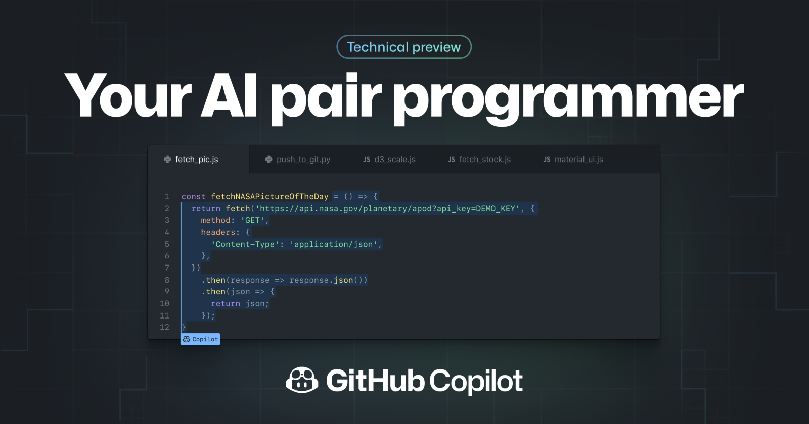

=== abstract à revoir !!!!! =======
 The most profound shift in software engineering isn't a new language,
  framework, or cloud service. It's the transition from writing code to
  expressing intent, and trusting intelligent systems to translate that intent
  into working software. Writing code for the sake of writing code has never
  been the point of software engineering, it is about creating a solution to
  human problems. Software engineering is **more** than just writing code.

## What is Agentic?

Software development offers a striking illustration of the speed at which
generative AI has evolved and been adopted. Developers were instrumental in
building and advancing this technological revolution, but they are also among
the first to experience its disruptive effects.

Within only a few years, AI systems have progressed from simple coding
assistants to increasingly autonomous agents capable of planning, writing,
testing, and modifying code with limited human oversight.

Agentic coding does not eliminate software engineering, but rather moves
engineering effort from writing code to designing the environment in which
implementations can be produced, tested, and trusted.

Think of an AI agent as a digital worker made up of five essential parts:

1. **The model is its brain.**

  > Usually powered by a [large language model](https://en.wikipedia.org/wiki/Large_language_model),
  it examines the situation, reasons about what to do next, and produces a thought,
  an action, or a response.

2. **Tools are its hands.**

> They allow the agent to act in the outside world by calling APIs, running
  code, searching databases, or asking other agents for help.

3. **Memory is its notebook.**

> It helps the agent remember previous interactions, retrieve project-specific
  instructions, and preserve useful information from one task or session to
  another.

4. **Orchestration is its nervous system.**

>  It coordinates the entire process: feeding information to the model
  activating the right tools, collecting their results, and deciding whether the
  agent should continue or stop.

5. **Deployment is its workplace.**

> It provides the infrastructure the agent needs to operate reliably in the real
  world, including hosting, identity management, monitoring, security, and
  production systems.

### A New Paradigm

A new paradigm, in which developers express *what* they want to build rather
than *how* to build it, has emerged. Rather than following a strict chronological
eras that replace one after another, we should think as **different levels of abstraction**.
Autocomplete, chat, synchronous agents, background agents, and autonomous
workflows continue to coexist and varies accros industries.

#### Level 1: Autocompletion

The first generation was autocomplete. Tools, like [Github Copilot in 2021](https://github.blog/news-insights/product-news/introducing-github-copilot-ai-pair-programmer/),
predicted the next line, filled in boilerplate, and saved keystrokes on
repetitive patterns.

Even though the feature is useful and genuinely time-saving, the workflow stayed
identical. Software engineers wrote code, ran it, debug, and repeat. AI tool
assisted by reducing friction.

{width=200}

#### Level 2: Collaboration

The second generation introduced synchronous AI assistants. You described a task in
natural language, and the model generated code in response. As [Andrej Karpathy](https://karpathy.ai/)
famously wrote in January 2023:

> “The hottest new programming language is English.”

This phrase perfectly captures an era defined by a continuous back-and-forth
between a developer and a generative AI chatbot. The model generated an initial
version of the code, which you then reviewed, corrected, and refined through
successive prompts until you reached a working result.

This represented another step up the delegation stack. Compared with the previous
generation, the developer spent less time writing code directly and more time
describing their intent. However, human involvement was still required at every
stage. The AI acted as a collaborator, not as an autonomous worker. You retained
the overall context, decided what should happen next, and identified mistakes as
they occurred.

<blockquote class="twitter-tweet" data-lang="en" data-theme="dark"><p lang="en" dir="ltr">The hottest new programming language is English</p>&mdash; Andrej Karpathy (@karpathy) <a href="https://x.com/karpathy/status/1617979122625712128?ref_src=twsrc%5Etfw">January 24, 2023</a></blockquote> <script async src="https://platform.x.com/widgets.js" charset="utf-8"></script>

:::{.callout-note collapse=false title="Side notes on Vibe Coding"}
##### What is Vibe Coding

Two years after declaring English to be the “hottest new programming language”,
Andrej Karpathy coined the term **vibe coding**. He described it as a way of
programming in which you “fully give in to the vibes, embrace exponentials, and
forget that the code even exists.”

<blockquote class="twitter-tweet" data-theme="dark"><p lang="en" dir="ltr">There&#39;s a new kind of coding I call &quot;vibe coding&quot;, where you fully give in to the vibes, embrace exponentials, and forget that the code even exists. It&#39;s possible because the LLMs (e.g. Cursor Composer w Sonnet) are getting too good. Also I just talk to Composer with SuperWhisper…</p>&mdash; Andrej Karpathy (@karpathy) <a href="https://x.com/karpathy/status/1886192184808149383?ref_src=twsrc%5Etfw">February 2, 2025</a></blockquote> <script async src="https://platform.x.com/widgets.js" charset="utf-8"></script>

Vibe coding reflects the growing capabilities of generative AI tools and their
expanding role in software development. In this approach, users express what
they want to build through natural-language prompts or speech, and an AI
system translates those instructions into executable code. Rather than focusing
on syntax or implementation details, the user concentrates on the desired
outcome and guides the system through successive iterations.

However, vibe coding is more than simply using an AI coding assistant. It
requires trust in the model and interaction with the resulting software.
Therefore, rather than understanding its source code, you primarily engage
with it like a final users would have. This conversational cycle continues
until the application appears to work as intended.

By prioritising experimentation over immediate improvements to structure and
performance, vibe coding adopts a “build first, refine later” mindset. It can
therefore support rapid prototyping, iterative development, and short feedback
loops. These qualities are broadly consistent with agile development practices,
as they allow developers to test ideas and produce prototypes quickly.

Speed comes with a trade-off. When users accept generated code without fully
reviewing or understanding it, they may accumulate technical debt, introduce
hidden vulnerabilities, or create systems that become difficult to maintain.
Vibe coding can accelerate the production of a working prototype, but it does
not eliminate the need for software engineering discipline.
:::

#### Level 3: Delegation

The third generation marks the shift from collaboration to delegation. Instead
of guiding the AI step by step, the developer defines an outcome and allows an
**autonomous agent** to manage the workflow.

The agent can inspect a repository, plan changes, modify multiple files, install
dependencies, run tests, diagnose failures, and submit a pull request. It may
work independently for minutes or hours while the developer focuses on other tasks.

The level of abstraction is no longer a line of code or a prompt, but an entire 
task. Human involvement moves from continuous direction to asynchronous
supervision: the agent executes the work, while the developer sets the
constraints, reviews the results, and remains accountable for the final
decision.

<blockquote class="twitter-tweet" data-lang="en" data-dnt="true" data-theme="dark"><p lang="zxx" dir="ltr"><a href="https://t.co/jZKOk8RAsV">https://t.co/jZKOk8RAsV</a></p>&mdash; Michael Truell (@mntruell) <a href="https://x.com/mntruell/status/2026736314272591924?ref_src=twsrc%5Etfw">February 25, 2026</a></blockquote> <script async src="https://platform.x.com/widgets.js" charset="utf-8"></script>

#### Level 4: Orchestration

A fourth level is now emerging: **orchestration**. Instead of delegating an
entire task to a single agent, a human or coordinating system divides the work
among multiple specialised agents, manages dependencies, and routes their outputs
through testing and verification.

At this level, the developer no longer supervises individual tasks but oversees
a system of agents working together. The focus shifts from directing execution
to designing workflows, setting boundaries, and defining how results will be
evaluated.

> Autonomy is not binary. It is the gradual transfer of control over increasingly
large portions of the development loop.

------------- CONTINUE -----------------------------

## The Factory and Its Operator

The mental model that ties these transformations together is the **factory model**.
In this model, the developer's primary output is not the  code: it's **the system
that produces code**.

### The factory is the system

To continue the metaphor of AI agent as a digital worker, real world factories
builds cars, appliances, etc. Over the last couple of centuries they have
refined the production of goods to mostly automate the production lines.

This system includes:

- Specifications and context that define what needs to be built
- Agents that translate specifications into implementation
- Tests and quality gates that verify correctness
- Feedback loops that route failures back to agents for correction
- Guardrails that constrain agents to safe, predictable behavior

A factory manager does not assemble every widget by hand. They design the assembly
line and ensure quality control. Success comes from giving agents **success
criteria rather than step-by-step instructions**, then letting them iterate.

```{mermaid}
%%| label: fig-factory-model
%%| fig-cap: "The Factory Model — Developer designs the system, agents produce the code, tests verify the output"
flowchart TD
    Dev["👨‍💻 Developer\n(Factory Manager)"]

    subgraph Factory["🏭 The Factory"]
        direction TB
        Spec["📋 Specifications\n& Context"] --> Agents["🤖 AI Agents\n(Implementation)"]
        Agents --> Tests["✅ Tests\n& Quality Gates"]
        Tests --> FL["🔄 Feedback\nLoops"]
        FL --> Agents
        GR["🛡️ Guardrails\n& Constraints"] --> Agents
    end

    Dev --> Factory
    Factory --> Code["📦 Production\nCode"]

    style Factory fill:#1a1a2e,stroke:#4a4a8a,color:#fff
    style Dev fill:#533483,stroke:#7a5ab5,color:#fff
    style Code fill:#1a3d1a,stroke:#4a8a4a,color:#fff
```

### The orchestrator coordinates the system

> Explain decomposition, delegation, dependency management, monitoring, and escalation.

The developer's evolving role:
conductors and orchestrators
As AI takes over more of the implementation work, the developer's role is transforming in
ways that are both exciting and disorienting. We find it useful to think of two modes that
developers move between fluidly: conductor and orchestrator.12

The conductor: hands-on, real-time direction
In conductor mode, a developer works in real-time with an AI pair-programmer. They're in
the IDE, watching code appear, guiding the AI with prompts and corrections, and maintaining
fine-grained control over what gets written. The AI is a powerful instrument, but the
developer is actively directing every movement.

This mode is typical when working on complex logic, debugging tricky issues, or working in
unfamiliar codebases where the developer needs to understand each change as it's made.
Tools like GitHub Copilot, Google's Gemini Code Assist, Cursor, and Windsurf primarily
support this mode through inline completions, chat interfaces, and edit-in-place capabilities.
The conductor mode is natural for developers who come from traditional engineering
backgrounds. It preserves the sense of understanding and control that many engineers value.
The risk is that it can also become a bottleneck - if the developer is personally directing every
keystroke, the throughput improvement from AI is limited.
The orchestrator: async, multi-agent delegation
In orchestrator mode, the developer operates at a higher level of abstraction. They
define goals, assign them to agents, and review results - but they're not watching code
appear line by line. Agents may be working in the background, in parallel, on different
parts of a codebase. The developer checks in periodically, reviews output, and provides
course corrections.
This mode is typical for well-defined tasks like bug fixes, feature implementations against
established patterns, codebase migrations, and test generation. Tools like Google's Jules,
GitHub Copilot's agent mode, Cursor's background agents, and Claude Code support this
mode through async task execution, often working in sandboxed environments with full
access to the repository, build tools, and test suites.13
The orchestrator mode requires a different skill set. Instead of deep expertise in syntax and
language idioms, it demands strong skills in:
• Specification: Defining tasks precisely enough that an agent can execute them
without ambiguity

Decomposition: Breaking large tasks into appropriately sized units for agent execution
• Evaluation: Quickly assessing whether agent output meets quality standards
• System design: Designing the constraints, tests, and feedback loops that keep
agents productive

#### Role transition

There's an uncomfortable truth here: _orchestrating_ agents feels a lot like
management: delegating tasks, reviewing output, redirecting when things go
sideways,etc. If you became an engineer because you didn't want to be a manager,
this shift might feel like a betrayal. The role changed underneath you.

=> https://addyosmani.com/blog/future-agentic-coding/

### The developer moves between conductor and orchestrator modes

> Explain synchronous supervision versus asynchronous delegation.

### Orchestration can itself be automated

> Explain machine orchestration while preserving human judgment and accountability.

#### The bottleneck becomes verification

> Explain why generating more code or running more agents does not automatically create more valuable software.


## Practical Patterns

1. Agent-first drafts with tight iteration loops

  Don’t use AI for one-off suggestions. Generate entire first drafts, then
  refine. The Claude Code team practice: have the model review its own code
  with a fresh context window. This catches issues before human review.

2. Declarative communication

  Spend 70% of effort on problem definition, 30% on execution. Write
  comprehensive specs, define success criteria, provide test cases up front.
  Guide the agent’s goals, not its methods.

3. Automated verification

  If you repeatedly fix the same class of mistake, write a test or lint rule
  preemptively. Make the agent explain its code and flag potential problems
  before you review.


-----------------
## A New Software Development Life Cycle (SDLC)

The software development life cycle has already been through one major
transformation. Over the past two decades, most enterprises moved from sequential
waterfall processes to iterative models: Agile sprints, continuous integration,
DevOps pipelines, and rapid release cycles.

**AI compresses this cycle dramatically, but unevenly:** implementation that once
took weeks can now be done in hours, while requirements, architecture, and
verification remain stubbornly human-paced.


### The Pareto Law

= https://addyo.substack.com/p/the-80-problem-in-agentic-coding

Andrej Karpathy Twitter / X

= Boris Cherney :
> “Pretty much 100% of our code is written by Claude Code + Opus 4.5. For me
> personally it has been 100% for two+ months now, I don’t even make small edits
> by hand. I shipped 22 PRs yesterday and 27 the day before, each one 100%
> written by Claude. I think most of the industry will see similar stats in the
> coming months - it will take more time for some vs others.”


...WIP...

Let AI do 80% of the work and focus your energy on the 20% left.

The 80% Problem

A persistent challenge: AI agents can rapidly generate approximately **80% of
the code** for a feature, but the remaining 20% — edge cases, error handling,
integration points, and subtle correctness requirements — demands deep contextual
knowledge that current models often lack.

The nature of AI errors has evolved from simple syntax mistakes to more insidious
**conceptual failures**: wrong assumptions about business logic, missing edge
cases, and architectural decisions that create subtle long-term maintenance
burdens. These errors are harder to detect because the code "looks right" and may
even pass basic tests.

::: {.callout-tip}
The developers who navigate this challenge most effectively use AI for what it's
good at (rapid implementation of well-specified tasks) while reserving their own
attention for what AI struggles with (ambiguous requirements, architectural
trade-offs, and correctness verification).
:::

## Where to Start

::: {.panel-tabset}
### For Individual Developers

1. **Set up an `AGENTS.md`** for the project. Start with ten lines: stack,
   conventions, hard rules, workflow. Add a rule every time the agent does
   something it should not do again.

2. **Install a set of skills** for your coding agents (like Agents CLI) to build,
   evaluate, deploy and optimize agents.

3. **Pick one repetitive workflow and make it the first agent.** A research
   workflow, a code review process, a recurring report. Use a coding agent for
   the prototype, graduate it to a production agent when it earns its keep.
   Building one agent end to end teaches more than reading about a hundred.

4. **Write the tests and evals before generating the code.** Together they are
   the contract with the AI. A well-written test and eval suite communicates
   intent more precisely than any natural-language prompt, and turns AI-assisted
   development from vibe coding into agentic engineering.

5. **Review every line the agent produces that is going to ship.** Be skeptical
   of anything that looks clever. Check imports for real packages. Verify that
   error handling covers realistic failure modes.

6. **Maintain your developer skills.** AI handles the routine so the developer
   can focus on the challenging. That arrangement only works if foundational
   skills — debugging, system design, intuition for performance and correctness
   — stay sharp.

### For Engineering Leaders

1. **Make context engineering a first-class engineering practice.** Treat
   `AGENTS.md`, system prompts, eval suites, and skill libraries as code:
   reviewed in pull requests, versioned with the project, owned by named
   engineers.

2. **Set the bar at the eval, not the demo.** A working demo proves an agent can
   succeed once. A passing eval suite proves it succeeds reliably. Define what
   you are scoring: task success, tool use quality, trajectory compliance,
   hallucination, and response quality.

3. **Re-shape code review for AI-generated code.** Extra attention to
   hallucinated dependencies, inadequate error handling, and subtle correctness
   gaps that look right at a glance.

4. **Distinguish prototyping work from production work in team norms.** Vibe
   coding is the right speed for exploration. Agentic engineering is the right
   discipline for production. Make the boundary explicit.

5. **Invest in harness components as a shared team asset.** Reusable system
   prompts, skill libraries, MCP server connections, and evaluation harnesses
   compound across projects. Treat them as infrastructure.

### For Organizations

1. **Treat AI-assisted development as an engineering investment, not a
   productivity feature.** Rolling out a coding agent without eval coverage,
   observability, and clear architectural standards produces speed without
   quality.

2. **Invest in the production substrate before scale.** What graduates a
   vibe-coded prototype to production is operations discipline: trajectory and
   final-response evals in CI, traces of every agent run, scoped permissions,
   and security review tuned to generated code's failure modes.

3. **Adopt open standards.** Model Context Protocol (MCP) for tool access and
   Agent2Agent (A2A) for cross-agent delegation are converging into the
   connective tissue of multi-agent systems.

4. **Plan for hybrid teams of humans and agents.** The strongest production
   results come from architectures where humans set direction, agents do the
   implementation, and clear handoff protocols govern the boundary.

5. **Reframe hiring and skill development around judgment, not just
   implementation.** The most valuable engineers in the next several years will
   be the ones who can direct agents well, not the ones who can write the most
   code.
:::


------- #######    TO REVIEW    ########----------------
    An AI agent is a software system that perceives a goal, plans steps to reach
    it, takes actions through tools, observes the results, and iterates until
    the goal is met or it hits a stopping condition. Where a chatbot produces a
    response and waits for the next prompt, an agent runs its own loop. You give
    it a goal at the top, then it decides what to do next at each step.


## References

The Factory Model: How Coding Agents Changed Software Engineering
 = https://addyosmani.com/blog/factory-model/
The third golden age of software engineering – thanks to AI, with Grady Booch
 = https://newsletter.pragmaticengineer.com/p/the-third-golden-age-of-software
5-Day AI Agents: Intensive Vibe Coding Course With Google
 = https://www.kaggle.com/learn-guide/5-day-agents-vibecoding