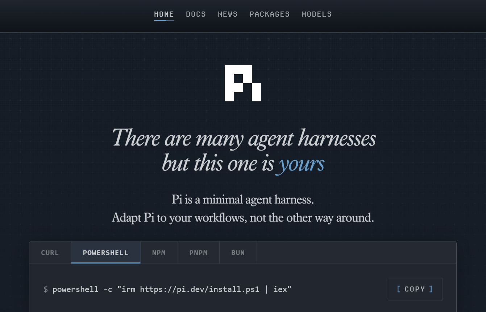

- https://www.langchain.com/blog/the-anatomy-of-an-agent-harness
- https://www.datacamp.com/blog/agent-harness*
- https://mitchellh.com/writing/my-ai-adoption-journey#step-5-engineer-the-harness

---
## Harness Engineering: What Surrounds the Model

There is a temptation to treat the model as the system. A new model comes out, the
agent gets smarter. That intuition is wrong, and it leads to the wrong investments.

**A raw model is not an agent.** It becomes one once a harness gives it state,
tool execution, feedback loops, and enforceable constraints. The behaviour
developers experience when working with Claude Code, Cursor, Codex, Aider, or
Cline is dominated by what the harness does, not just by which model is
underneath.

$$\text{Agent} = \text{Model} + \text{Harness}$$

```{mermaid}
%%| label: fig-harness-anatomy
%%| fig-cap: "Harness Anatomy — Agent = Model + Harness"
flowchart TB
    subgraph Harness["🔧 The Harness"]
        direction TB
        IR["📜 Instructions &\nRule Files\n(AGENTS.md, CLAUDE.md)"]
        Tools["🛠️ Tools\n(APIs, MCP Servers)"]
        Sandbox["📦 Sandboxes &\nExecution Environments"]
        Orch["🔀 Orchestration Logic\n(Sub-agents, routing)"]
        GR["🛡️ Guardrails / Hooks\n(Lifecycle checkpoints)"]
        Obs["📊 Observability\n(Logs, traces, evals)"]
    end

    Model["🧠 Model\n(Reasoning Engine)"] --> Harness
    Harness --> Agent["🤖 Agent\n(Working System)"]

    style Harness fill:#1a1a2e,stroke:#4a4a8a,color:#fff
    style Model fill:#533483,stroke:#7a5ab5,color:#fff
    style Agent fill:#1a3d1a,stroke:#4a8a4a,color:#fff
```

### What's in the Harness

- **Instructions and Rule Files** — the text that defines who the agent is, what
  it cares about, and what it is forbidden from doing. Includes `AGENTS.md`,
  `CLAUDE.md`, `GEMINI.md`, skill files, and sub-agent prompts.
- **Tools** — the functions, MCP servers, and APIs the agent can call, plus the
  prose that tells the model when and how to call them.
- **Sandboxes and execution environments** — where the agent's code actually
  runs, what it has access to, what it cannot reach.
- **Orchestration logic** — sub-agent spawning, model routing, hand-offs between
  specialists, and the rules that govern when each fires.
- **Guardrails / Hooks** — deterministic code that runs at specific lifecycle
  points: before a tool call, after a file edit, before a commit. Hooks are the
  place for things the agent should never forget but often does.
- **Observability** — logs, traces, evaluations, cost and latency metering.
  Without observability, there is no way to tell whether the agent is doing well
  or quietly drifting.

### Harness in SDLC

```{mermaid}
%%| label: fig-harness-sdlc
%%| fig-cap: "The Harness Across SDLC Phases"
flowchart LR
    subgraph P1["Phase 1\nRequirements & Architecture"]
        H1["⚙️ Configure\nInstruction files,\ntool access, rules"]
    end
    subgraph P2["Phase 2\nImplementation"]
        H2["▶️ Run\nSandboxes,\nexecution environments,\ntools"]
    end
    subgraph P3["Phase 3\nTesting & QA"]
        H3["🔄 Feedback Loop\nOrchestration logic,\nguardrails → self-correction"]
    end
    subgraph P4["Phase 4\nReview, Deploy & Maintain"]
        H4["👁️ Observe\nHooks, observability,\naudit trails"]
    end
    P1 --> P2 --> P3 --> P4

    style P1 fill:#1a2a3d,stroke:#4a6a8a,color:#fff
    style P2 fill:#1a3d1a,stroke:#4a8a4a,color:#fff
    style P3 fill:#3d2a1a,stroke:#8a6a4a,color:#fff
    style P4 fill:#2d1a3d,stroke:#6a4a8a,color:#fff
```

::: {.callout-important}
## Most Agent Failures are Configuration Failures
When an agent does something wrong, the first instinct is to blame the model.
More often, the failure traces back to a missing tool, a vague rule, an absent
guardrail, or a context window stuffed with noise. Public benchmarks confirm
this: one team moved a coding agent from outside the Top 30 to the Top 5 on
Terminal Bench 2.0 by changing **only the harness**, with no model change at all.
:::

1. Requirements, Planning, & Architecture (Configuring
the Harness)
This is where the harness is configured and calibrated. Before the AI writes any production
code, the developer must set up the agent's environment.
• Harness Configuration: Providing the Instructions and Rule Files (e.g., creating the
AGENTS.md and defining architectural constraints) that the harness will load and make
available to the model.
• The Action: The developer defines the tools the agent will have access to (like specific
APIs or database schemas) and sets the fundamental rules the agent cannot break.
2. Implementation (Running the Harness)
During active coding, the harness acts as the boundary that keeps the AI model focused,
secure, and productive.
• Harness Components Used: Sandboxes, Execution Environments, and Tools.
The Action: As the model generates code, it executes it within the harness's isolated
sandbox. If the model needs to read a file or search the web, it uses the tools provided
by the harness.
3. Testing & QA (The Feedback Loop)
Testing in an agentic workflow relies heavily on the harness to facilitate
autonomous self-correction.
• Harness Components Used: Orchestration Logic and Guardrails.
• The Action: When the agent writes a function, the harness provides the execution
environment (such as a sandboxed terminal) that allows the automated tests to be
executed. If a test fails, the orchestration logic captures the error output from that
environment and routes it back to the model, asking it to try again. The harness is what
creates this automated 'think -> act -> observe' loop."
4. Code Review, Deployment, & Maintenance (Observing
the Harness)
Even after the code is written, the harness ensures the agent behaves safely in live or
near-live environments.
• Harness Components Used: Hooks and Observability.
• The Action: The harness runs deterministic hooks (e.g., blocking a commit if the agent
tries to push a hard-coded password). Furthermore, the observability layer tracks token
costs, latency, and agent drift, allowing human engineers to audit exactly why an agent
made a specific deployment decision.
The transition from 'vibe coding' to 'agentic engineering' is not simply about the tools you
use—a developer can vibe code or apply agentic engineering using the exact same agent.
Instead, it is defined by how deliberately you configure and apply the harness. Vibe coding
relies on minimal or implicit scaffolding aimed purely at rapid implementation. Agentic
engineering relies on clear, extensive harness abstractions that guide the AI from the very
first planning document all the way through to production monitoring.
The impact of this deliberate configuration is highly measurable. Public benchmarks make the
size of the harness effect concrete. On Terminal Bench 2.0, one team moved a coding agent
from outside the Top 30 to the Top 5 by changing only the harness, with no model change at
all. A separate study at LangChain raised a coding agent's score on the same benchmark by
13.7 points by tweaking only the system prompt, tools, and middleware around a fixed model.
The everyday version of this observation is crucial for teams adopting AI across the SDLC:
when an agent does something wrong, the first instinct is to blame the model. More often,
the failure traces back to a missing tool, a vague rule, an absent guardrail, or a context
window stuffed with noise. Most agent failures, examined honestly, are configuration failures.

---

## Agent Harness vs. RALPH Loop: Understanding the Architecture of Modern AI Agents

*Intro hint:*  
Explain the confusion: people often mix “how an agent runs” vs “how an agent thinks.” Introduce both terms and why the distinction matters for anyone building or studying agentic systems.

### Why This Distinction Matters

*Hint:*  
Briefly explain that modern AI systems are no longer just prompts—they are structured systems. Emphasize that understanding the difference helps in designing, debugging, and scaling agents.

## What Is an Agent Harness?



### A Practical Definition

*Hint:*  
Define the harness as the environment/runtime that enables an agent to operate (tools, execution, memory, constraints).

### Core Components of an Agent Harness

*Hint:*  
List and briefly orient the reader on:

* Tooling (APIs, code execution, browsing)
* Memory (state, logs, persistence)
* Control system (loop orchestration)
* Observability (logs, traces)
* Safety/guardrails

### Mental Model: The “Body” of the Agent

*Hint:*  
Use analogy: harness = body/environment, agent = brain. Helps anchor intuition.

## What Is a ReAct / RALPH Loop?

### The Core Idea: Iterative Reasoning

*Hint:*  
Explain that loops define how the agent cycles through thinking and acting.

### The ReAct Loop (Reason + Act)

*Hint:*  
Introduce the canonical loop:
Observe → Think → Act → Observe → repeat  
Mention it’s the foundation of many modern agents.

### The RALPH Loop (An Extended Reasoning Pattern)

*Hint:*  
Explain it as a richer variant (Reason, Act, Learn, Plan, Hypothesize).  
Highlight that it introduces planning and learning steps.

### Mental Model: The “Cognitive Cycle”

*Hint:*  
Frame loops as the agent’s internal thinking process—like a decision-making rhythm.

## How They Work Together

### The Key Relationship

*Hint:*  
State clearly:

> The loop runs inside the harness  
> One is *behavior*, the other is *infrastructure*

### Putting It Together in a Real System

*Hint:*  
Describe a concrete example (e.g., coding agent, research agent).  
Separate:

* what the harness provides
* how the loop drives actions

### Common Confusion (and Why It Happens)

*Hint:*  
Explain that frameworks blur the line because they bundle both (e.g., LangChain, AutoGen).

## From Theory to Practice

### Frameworks as Agent Harnesses

*Hint:*  
Mention modern tools that implement harnesses (without going too deep): orchestration frameworks, agent platforms.

### Research as Loop Innovation

*Hint:*  
Position research work (ReAct, reflection loops, planning methods) as improvements to reasoning patterns—not the infrastructure.

## Final Takeaway

### The One-Sentence Distinction

*Hint:*  
Give a crisp takeaway:

> Agent harness = where the agent runs  
> Loop (ReAct / RALPH) = how the agent thinks

### Why This Will Matter Increasingly

*Hint:*  
Brief forward-looking note: as agents get more autonomous, separating system design (harness) from cognition (loop) will be critical.
