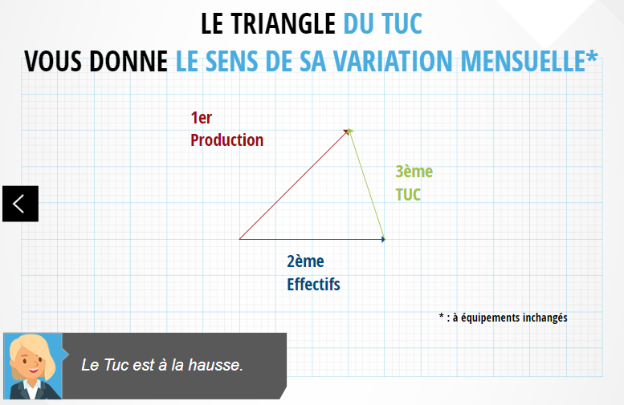

Le TUC mesure la tension sur l'appareil productif. Il se calcule : TUC = production effective / production maximale possible.

On entend production maximale possible lorsque les [[conjoncture.effectifs]] et les **équipements** en place sont utilisés au maximum.

=> La plupart du temps, les effectifs et les équipements, définissant la production maximale, sont stables. Dans ce cas, le TUC suit les évolutions de production.

## Cas #1

| Mois | Production (réalisée) | [[conjoncture.effectifs]] + Équipements | TUC                               |
| ---- | --------------------- | --------------------------------------- | --------------------------------- |
| M-1  | 1000                  | 20 + 80                                 | 1000 / 100 = 10                   |
| M    | 1500 (+50%)           | 20 + 80                                 | 1500 / 100 = 15 (TUC de M \* 1.5) |

## Exemples

1.  **Si une seule semaine a été travaillée au mois d'août** :

    - La production effective baisse
    - La production max ne baisse pas (les [[conjoncture.effectifs]] sont en congés, mais stables et les équipements restent les mêmes)
    - Les effectifs et les équipements sont moins utilisés.
      => Le TUC baissera!

2.  **Panne ou arrêt bref pour maintenance ou grève partielle** :

    - le TUC **baisse** car la production baisse alors que la production maximale reste la même.

3.  **Chômage partiel** :

    - Le TUC **baisse** car la production baisse alors que la production maximale reste la même. Les salariés en chômage partiel restent dans les [[conjoncture.effectifs]].

4.  **Fermeture pour congés** :

    -     - Le TUC **baisse** car la production baisse alors que la production maximale reste la même. Les salariés en congés restent dans les [[conjoncture.effectifs]].

## TUC proche de 100%

- proche du surrégime
- l'entreprise a des difficultés pour répondre à la demande
- carnet de commandes est rempli
- délais de livraison s'allonge
- Elle ne peut pas augmenter sa production plus livré plus et plus vite
- 2 possibilités :
  1. embauche/investir = augmenter capacité maximale de production
  2. augmente les prix = baisser la demande

## Triangle du TUC

