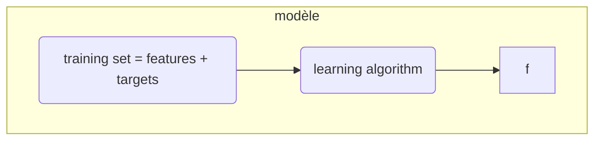
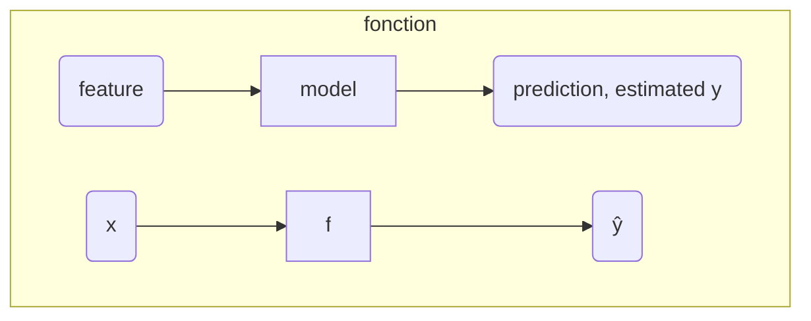

> Les algorithmes de régression permettent de **prédire un nombre** dans une infinité de nombres possibles. En mathématique, ces [[données|ds.data.dataset]] sont dites continues, comme le salaire d’une personne ou la valeur d’une action côtée.

Pour ça, on utilise les [[équations linéaires|m.algebra.linear-equation]], cherchant à trouver la meilleure fonction à travers un nuage de points.

## Une mise en application avec [[Python|l.python.ml]]

### Régression linéaire

![[l.py.ml.supervised-learning.linear-reg]]

## Références

- https://lms.fun-mooc.fr/courses/course-v1:inria+41026+session03/courseware/4594c1d8c9f847bdbc733c34d941c988/928e7401d2ed48a791036c555bca6d06/

---

Le jeu de données d’entraînement est appelé un **training set**. Il est constitué de donnée connues et étiquetées qui vont servir pour entraîner le modèle. Ci-dessous, un exemple de training set.

## Training Set

| Rows | size in feet$^2$ | Price in $1000’s Example |
| :--: | :--------------: | :----------------------: |
|      |     **$x$**      |         **$y$**          |
| (1)  |       2104       |           400            |
| (2)  |       1416       |           232            |
| (3)  |       1534       |           315            |
| (4)  |       852        |           178            |
|  …   |        …         |            …             |
| (47) |       3210       |           870            |

---

$x$ = variable d’« input » ou la **feature**. Dans ce cas, il s’agit de la taille des maisons.

$y$ = varible d’« ouput » ou la **target** variable. Dans l’exemple ce sont les prix des maisons.

$m$ = nombre de données, ou d’exemple d’entraînement dans le training set. Dans l’exemple, $m = 47$.

Pour spécifier une donnée du jeu d’entrainement, on écrit $(x^{(i)}, y^{(i)})$ où $(i)$ est la énième donnée du jeu. Par exemple, $(x^{(1)}, y^{(1)}) = (2140, 400)$

## Cost function

Dans la [[ml.sl.reg.model.math]], $f_{w, b} (x) = wx + b$, $w$ et $b$ sont appelés :

- **paramètres**, _parameters_ ;
- **coéficients**, _coefficients_ ;
- **poids**, _weights_.

## Références

- https://www.coursera.org/learn/machine-learning/lecture/1ACA2/linear-regression-model-part-1
- https://www.coursera.org/learn/machine-learning/lecture/1Z0TT/cost-function-formula

---

:PROPERTIES:
:ID: e4f080c4-1369-4302-bab5-2edd2e01cb95
:END:
#+title: simple linear regression

- simple linear regression
  :PROPERTIES:
  :NOTER_DOCUMENT: ../zotero/storage/9HC432RX/Cornillon et al_2019_Régression Avec R - 2e édition.pdf
  :NOTER_PAGE: 15
  :END:

simple linear regression is a statistical approach for predicting a
_quantitative_ response $Y$ on the basis of a single predictor variable $X$.
It assumes that there is approximately a linear relationship between $X$ and $Y$.
Mathematically, we can write this linear relationship as:

$Y \approx \beta_{0} + \beta_{1} X$

-
- cost fonction

[[m.algebra.linear-equation]]

## Régression linéaire

La formule mathématique pour représenter $f$ dans le [[modèle|ml.sl.reg.model]] de régression en supervised learning est le même que pour une [[équation linéaire|m.algebra.linear-equation]] :

$f_{w, b} (x) = wx + b$

$w$ est le coeficient directeur, ou _slope_, de la [[équation linéaire|m.algebra.linear-equation]] et $b$ est l’ordonnée à l’origine, ou _y-intercept_. On peut simplifier la formule en $f(x) = wx + b$ pour retouver l’équation d’une droite.

> En machine learning $w$ et $b$ sont des constantes, appelée **paramètres**, _parameters_, selon la [[terminologie|ml.sl.reg.terminology]].

En supervised learning, ce modèle s’appelle une régression linéaire à une variable, ou **univariate** linear regression.

### Prédiction

Le modèle de régression permet de prédire $ŷ^{i}$, on peut donc trouver la formule

> $ŷ^{i} = f_{w, b} (x^{i})$

Puisque

> $f_{w, b} (x) = wx + b$

Alors

> $ŷ^{i} = wx^{i} + b$

### Objectif

L’objectif du modèle mathématique est de trouver $w$ et $b$ pour que $ŷ^{i}$ soit le plus proche possible de $y^{i}$ pour tout ($x^{i}, y^{i}$). Pour cela on utilise une [[ds.ml.sl.reg.cost-function]].

## Régression linéaire



> La fonction $f$ s’appele historiquement une **hypothèse** (_hypothesis_).



> $ŷ$ est la prédiction de la fonction hypothèse. Il ne s’agit pas de la valeur $y$ mais de l’estimation par le modèle.

## Référence

https://www.coursera.org/learn/machine-learning/lecture/nucNi/linear-regression-model-part-2


## Importer les librairies et paquets essentiels

- [[numpy]]
- [[py.matplotlib]]

```python
import numpy as np
import matplotlib.pyplot as plt
```

## Générer le training set

Pour cette exemple, on utilise un `training set` simplifié, avec deux données, pour prédire le prix des maisons.

| Size (1000 sqft) | Price (1000s of dollars) |
| ---------------- | ------------------------ |
| 1.0              | 300                      |
| 2.0              | 500                      |

Dans ce cas, on utilise des [[numpy-array]] pour le jeu de données.

```python
# x_train is the input variable (size in 1000 square feet)
# y_train is the target (price in 1000s of dollars)
x_train = np.array([1.0, 2.0])
y_train = np.array([300.0, 500.0])
print(f"x_train = {x_train}")
print(f"y_train = {y_train}")
```

```shell
x_train = [1. 2.]
y_train = [300. 500.]
```

### Number of training examples `m`

You will use `m` to denote the number of training examples. Numpy arrays have a `.shape` parameter. `x_train.shape` returns a python tuple with an entry for each dimension. `x_train.shape[-1]` is the length of the array and number of examples as shown below.

```python
# m is the number of training examples
print(f"x_train.shape: {x_train.shape}")
m = x_train.shape[0]
print(f"Number of training examples is: {m}"
```

One can also use the Python [[python-len]] `len()` function as shown below

```python
# m is the number of training examples
m = len(x_train)
print(f"Number of training examples is: {m}"
```

### Training example `x_i, y_i`

You will use (x$^{(i)}$, y$^{(i)}$) to denote the $i^{th}$ training example. Since Python is zero indexed, (x$^{(0)}$, y$^{(0)}$) is (1.0, 300.0) and (x$^{(1)}$, y$^{(1)}$) is (2.0, 500.0).

To access a value in a Numpy array, one indexes the array with the desired offset. For example the syntax to access location zero of `x_train` is `x_train[0]`.
Run the next code block below to get the $i^{th}$ training example

```python
i = 0 # Change this to 1 to see (x^1, y^1)

x_i = x_train[i]
y_i = y_train[i]
print(f"(x^({i}), y^({i})) = ({x_i}, {y_i})")
```

### Plotting the data

ou can plot these two points using the `scatter()` function in the `matplotlib` library, as shown in the cell below.

- The function arguments `marker` and `c` show the points as red crosses (the default is blue dots).

You can use other functions in the `matplotlib` library to set the title and labels to **display**

```python
# Plot the data points
plt.scatter(x_train, y_train, marker='x', c='r')
# Set the title
plt.title("Housing Prices")
# Set the y-axis label
plt.ylabel('Price (in 1000s of dollars)')
# Set the x-axis label
plt.xlabel('Size (1000 sqft)')
plt.show()
```


## Model function


As described in lecture, the model function for linear regression (which is a function that maps from `x` to `y`) is represented as

$f_{w,b}(x^{(i)}) = wx^{(i)} + b$

The formula above is how you can represent straight lines - different values of $w$ and $b$ give you different straight lines on the plot. Let's try to get a better intuition for this through the code blocks below. Let's start with $w = 100$ and $b = 100$.

```python
w = 100
b = 100
print(f"w: {w}")
print(f"b: {b}")
```

Now, let's compute the value of $f_{w,b}(x^{(i)})$ for your two data points. You can explicitly write this out for each data point as :

for $x^{(0)}$, `f_wb = w * x[0] + b`

for $x^{(1)}$, `f_wb = w * x[1] + b`

For a large number of data points, this can get unwieldy and repetitive. So instead, you can calculate the function output in a `for` loop as shown in the `compute_model_output` function below.

> **Note**: The argument description `(ndarray (m,))` describes a Numpy n-dimensional array of shape (m,). `(scalar)` describes an argument without dimensions, just a magnitude.  
> **Note**: `np.zero(n)` will return a one-dimensional numpy array with $n$ entries

```python
def compute_model_output(x, w, b):
    """
    Computes the prediction of a linear model
    Args:
      x (ndarray (m,)): Data, m examples
      w,b (scalar)    : model parameters
    Returns
      y (ndarray (m,)): target values
    """
    m = x.shape[0]
    f_wb = np.zeros(m)
    for i in range(m):
        f_wb[i] = w * x[i] + b

    return f_wb
```

Now let's call the `compute_model_output` function and plot the output…

```python
tmp_f_wb = compute_model_output(x_train, w, b,)

# Plot our model prediction
plt.plot(x_train, tmp_f_wb, c='b',label='Our Prediction')

# Plot the data points
plt.scatter(x_train, y_train, marker='x', c='r',label='Actual Values')

# Set the title
plt.title("Housing Prices")
# Set the y-axis label
plt.ylabel('Price (in 1000s of dollars)')
# Set the x-axis label
plt.xlabel('Size (1000 sqft)')
plt.legend()
plt.show()
```


> As you can see, setting $w = 100$ and $b = 100$ does _not_ result in a line that fits our data.

Try $w = 200$ and $b = 100$

```python
w = 100
b = 100

tmp_f_wb = compute_model_output(x_train, w, b,)

# Plot our model prediction
plt.plot(x_train, tmp_f_wb, c='b',label='Our Prediction')

# Plot the data points
plt.scatter(x_train, y_train, marker='x', c='r',label='Actual Values')

# Set the title
plt.title("Housing Prices")
# Set the y-axis label
plt.ylabel('Price (in 1000s of dollars)')
# Set the x-axis label
plt.xlabel('Size (1000 sqft)')
plt.legend()
plt.show()
```


### Prediction

Now that we have a model, we can use it to make our original prediction. Let's predict the price of a house with 1200 sqft. Since the units of $x$ are in 1000's of sqft, $x$ is 1.2.

```python
w = 200
b = 100
x_i = 1.2
cost_1200sqft = w * x_i + b

print(f"${cost_1200sqft:.0f} thousand dollars")
```

## Références

https://www.coursera.org/learn/machine-learning/ungradedLab/PhN1X/optional-lab-model-representation/lab?path=%2Fnotebooks%2FC1_W1_Lab03_Model_Representation_Soln.ipynb
