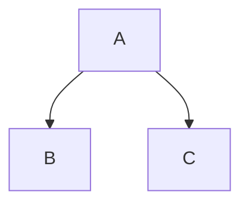
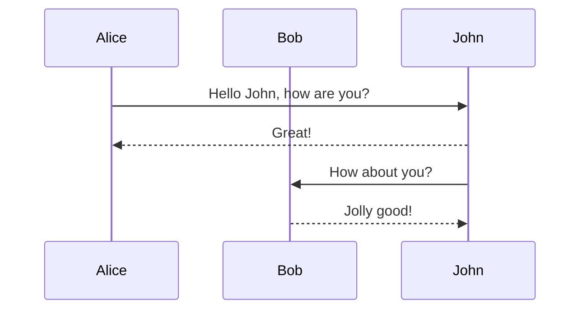

# Markdown

Markdown is intended to be as easy-to-read and easy-to-write as is feasible. It
was developed in 2004 by John Gruber[^1] in collaboration with Aaron Swartz.
Gruber wrote the first markdown-to-html converter in Perl, and it soon became
widely used in websites. By 2014 there were dozens of implementations in many
languages.

[1]: https://daringfireball.net/projects/markdown/

## Markdown Flavors

https://github.com/dcurtis/markdown-mark
3. [Markua](http://markua.com/)
4. [[Pandoc’s Markdown|markdown.pandoc]]
5. Rmd
5. Qmd

## Tools

[Mermaid](https://mermaid.js.org/)

> It is a JavaScript based diagramming and charting tool that renders Markdown-inspired text definitions to create and modify diagrams dynamically.

[Marksman](https://github.com/artempyanykh/marksman)

> Marksman is a program that integrates with your editor to assist you in writing and maintaining your Markdown documents. Using LSP protocol it provides completion, goto definition, find references, rename refactoring, diagnostics, and more. In addition to regular Markdown, it also supports wiki-link-style references that enable Zettelkasten-like

## Commentaires

Comme pour [[html#commentaires]], les commentaires commencent `<!--` et se treminent par `-->`.

## Paragraphes et sauts de ligne

Un nouveau paragraphe est défini par une ligne _vide_, et un saut de ligne par deux _espace_ en fin de ligne.

```markdown
Ceci est une première phrase.

Et voici un nouveau paragraphe

Si, je veux un saut de ligne, j'ajoute 2 espaces en fin de lignes.  
Comme ceci !
```

## Tableaux (_table_)

| Formatting    |     Example     |
| :------------ | :-------------: |
| Bold          | **Hello World** |
| Italics       |  _Hello World_  |
| Strikethrough | ~~Hello World~~ |

## Code Cell

Here is a Python code cell:

```python
import os
os.cpu_count()
```

## Images

> 🌱 Copy any image onto your clipboard, and then use the `Paste Image` command while focused in your editor pane. This will automatically create a link for you and copy the file contents into the assets directory in your workspace.

Sample Image Link:


## Equations

Use LaTeX to write equations:

$$
\chi' = \sum_{i=1}^n k_i s_i^2
$$

- Expressions inside `$`...`$` will be rendered using inline format.
- Expressions inside `$$`...`$$` will be rendered using block format.

$\int_{-\infty}^\infty f(x)dx$

## Diagrams

Various types of diagrams are supported with the [mermaid](https://mermaid-js.github.io/mermaid/#/) visualization syntax.

### Flow Charts



### Sequence Diagrams



## Note References

You can link to a specific section of a different note and have the content in-lined into the current note.

```markdown
![[tutorial#welcome-to-dendron:#*]]
```

## HTML code

[IBM Plex® typeface](https://github.com/IBM/plex)

<p align="center">
  <a href="https://www.ibm.com/plex/">
    
  </a>
</p>

## [Alertes](https://docs.github.com/fr/get-started/writing-on-github/getting-started-with-writing-and-formatting-on-github/basic-writing-and-formatting-syntax#alerts)

```markdown
> [!TIP]
> See the [installation guide](https://ibis-project.org/install) for more installation options.
```
