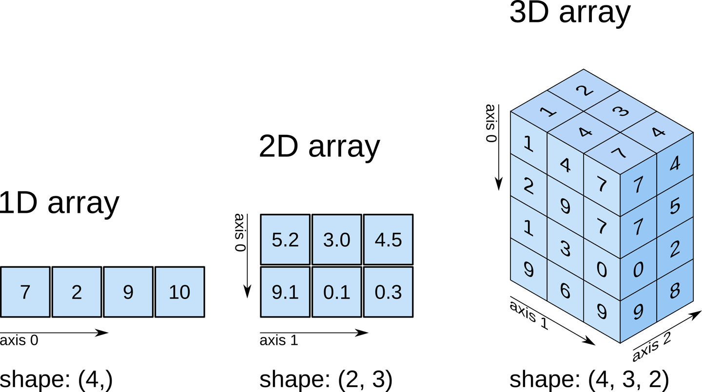

# Computer Science

## Qu’est-ce qu’une `array`

En informatique, une `array` est une structure de données, comprenant une
collection d’éléments (valeurs, variables, objets) pouvant être identifié par
un indices (_index_), comme [[py.dt.list]] python.

## variables

En informatique, une variable est utilisée par le programme pour mémoriser une
information. Comme une boîte de rangement, une variable possède une étiquette
pour savoir ce qu’il y a dedans; et bien sûr, un contenu, une valeur, une
information.

On distingue généralement cinq opérations sur les variables, chacune pouvant revêtir des formes syntaxiques différentes.

- la **déclaration** permet de déclarer un nom de variable, éventuellement de lui associer un type ;
- la **[[définition|cs.define]]** permet d'associer une zone mémoire qui va être utilisée pour stocker la variable, comme lorsqu'on lui donne une valeur initiale ;
- l'**affectation** consiste à attribuer une valeur à une variable ;
- la **lecture** consiste à utiliser la valeur d'une variable ;
- la **suppression** réalisée soit automatiquement soit par une instruction du langage.

## Comment nommer une variable

- `b` (single lowercase letter)
- `B` (single uppercase letter)
- `lowercase`
- `UPPERCASE`
- `UPPER_CASE_WITH_UNDERSCORES`
- `CapitalizedWords` (or CapWords, or CamelCase – so named because of the bumpy look of its letters [4]). This is also sometimes known as StudlyCaps. Note: When using acronyms in CapWords, capitalize all the letters of the acronym. Thus HTTPServerError is better than HttpServerError.
- `mixedCase` (differs from CapitalizedWords by initial lowercase character!)
- `Capitalized_Words_With_Underscores` (ugly!)

## snake case

## Define

To provide the explicit value or behavior of a newly created piece of code, such as a function, variable, or custom type. For example, you define a function by providing a set of commands within the function to tell it what to do.

## Good Code

La notion de _good code_ est difficile à définir car elle est souvent objective. Pour David J. Malan, _good code_ doit suivre 3 étapes :

1. **Correct**, le code doit résoudre précisement un problème ;
2. **Design**, le code doit être efficace et lisible ;
3. **Style**, le code doit être formaté pour facile à lire.
