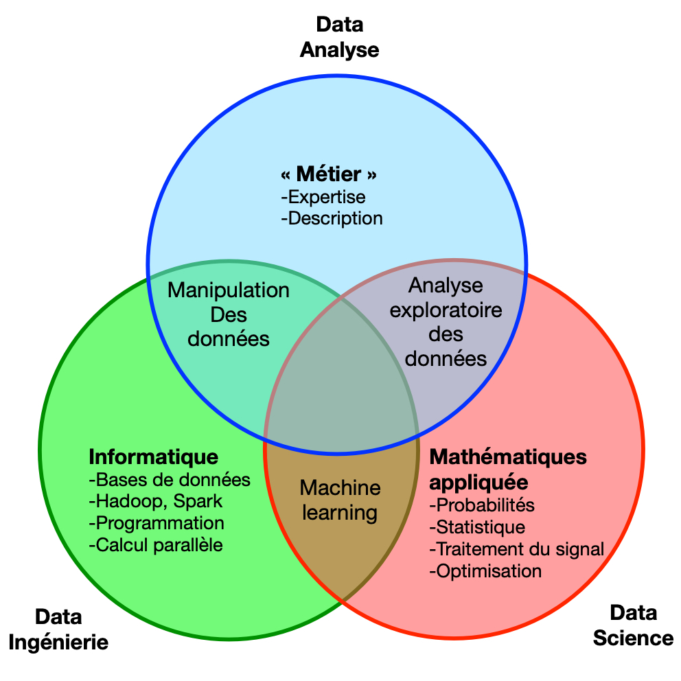

## le parcours « data »

### métier

la première étape d’un projet de machine learning est la **problématique métier**.
On y retrouve les objectifs à atteindre, le ou les jeux de données ainsi que
l’expertise métier.

### informatique

Dans un seconde étape, relative à l’ingénierie data, on retrouve la préparation
des donées, avec la collecte, le stockage et l’accès des données.

### mathématiques appliquées

La dernière étape, celle de science des données :

## Types de données

1. Quantitatives (_continuous data_) : données chiffrées. Les algorithmes [[ds.ml.sl.reg]] permettent de prédire les données quantitatives ;
1. Qualitatives (_categorial data_) : données labellisées, comme _faible_, _moyen_, _fort_. En modélisation, la prédiction de données qualitatives est un problème de [[ds.ml.sl.class]]
