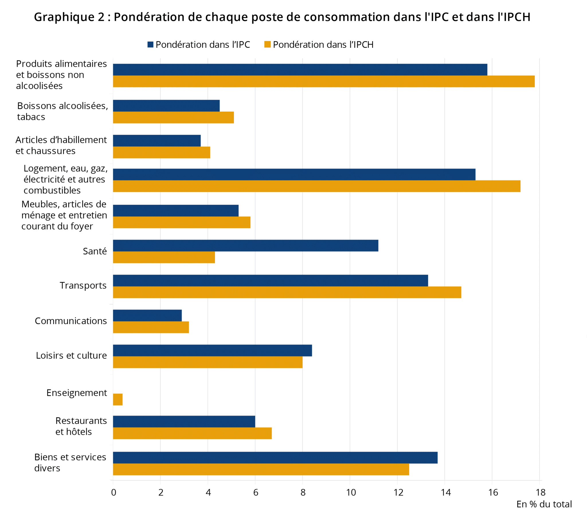
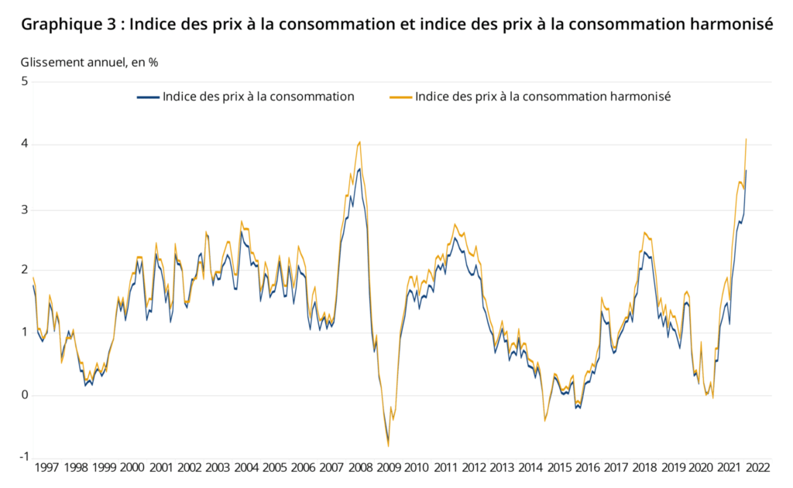

- [IPCH - contribution au taux d'inflation annuel de la zone euro(en point de pourcentage)](https://ec.europa.eu/eurostat/databrowser/view/prc_hicp_ctrb/default/table?lang=fr)

C'est une mesure quantitative de l'évolution **moyenne** des prix à la consommation sur une année. C'est-à-dire, aujourd'hui par rapport à la même époque l'annéee dernière. Elle s'exprime en pourcentage (%).

## IPC - Indice des Prix à la Consommation (index of consumer prices: _ICP_)

Instrument statistique à partir duquel on calcule l'inflation.

### Comment ?

Depuis sa création en 1946, l'INSEE relève mensuellement le prix de 160.000 références dans 30.000 points de vente en France. Il y a presque un siécle, l'indice était composé de « 34 articles », principalement alimentaire.

Aujourd'hui, les techniques de _webscrapping_ et la remonté des données de caisse de la distribution permettent d'avoir une vision complète des modes de consommation des ménages.

### Quoi ?

Les postes de consommation retenues dans l'IPC sont :

- produits alimentaires
- alcool et tabac
- habillement et chaussures
- logement, eau, gaz, électricité et autres combustibles
- meubles et produits ménagers
- santé
- transport
- communication
- loisirs et culture
- restaurants et hôtels
- biens et services divers

chaque poste de consommation est **pondéré** selon son importance dans le panier total :

$$\frac{\sum alcool et tabac}{\sum consommation totale}$$ = poids du poste alcool et tabac.

## ICPH - Indice harmonisé des prix (Harmonised index of consumer prices: _HICP_)

L'IPCH est l'équivalent, pour la zone euro, de l'IPC en France. Il est construit sur le même relevé des prix, mais Il est **harmonisé** au travers des recommandations d'[[https://ec.europa.eu/eurostat/web/main/home][Eurostat]].

#### Quelle différence entre IPC et IPCH ?

Dans l'IPCH, les dépenses comptabilisées sont celles restant à la charge des ménages après l’éventuel remboursement des pouvoirs publics ou de la sécurité sociale. On parle de prix « net ».À l'inverse, l'IPC comptabilise l'intégralité du prix du bien ou du service concerné (prix « brut »).

C’est dans le poste santé que la différence est la plus marquée, compte tenu la couverture sociale en France. Une autre différence, mineure, l’IPCH comprend un poste « éducation élémentaire », correspondant aux frais d’inscription à l’école privée, à hauteur de 0,06 % du total en France.

## Le poste logement dans l'IPC

### Les problématiques de la comptabilisation des dépenses de logement

La comptabilisation du logement, plus particuliérement du loyer pour les propriétaire de leurs logements ne correspond pas à une consommation « pure » car :

- Le logement est aussi un patrimoine pour les propriétaires ;
- **Mais** les propriétaires profitent aussi du logement comme les locataires.

Actuellement, les variations de prix des logements des propriétaires n'est pas comptabilisées dans l'IPC, ni dans l'IPCH. À l'inverse, les loyers des locataires sont intégrés dans les deux indices. Ils représentent, environ, 8 % du panier de l'IPCH (20 % pour le poids du loyer x 40 % nombre de personnes locataires en France).

### Dépenses courantes liées au logement

Les dépenses courantes liées au logement, comme les assurances, l'énergie, la réparation, les travaux de rénovation, etc. sont intégrées dans les indices pour les locataires et les propriétaires. Elles représentents, environ, 10 %.

## Inflation sous-jacente

Elle exclut les produits à prix volatils (produits laitiers, produits frais, viandes = alimentaire / produits pétroliers = énergie, etc.) car ils sont constitués de chocs transitoires. C'est-à-dire qu'ils subissent des mouvements très variables dus à des facteurs climatiques ou des tensions sur les marchés mondiaux, ainsi que les prix soumis à l'intervention de l'État (tabac, gaz, électricité). Parfois, on peut entendre IPCH hors alimentaire et énergie.

### Enjeux de la [[economics.monetary-policy]]

L'évolution de l'inflation sous-jacente permet d'anticiper les évolutions, à moyen terme, de l'IPC car elle exclut les chocs transitoires et permet de distinguer la tendance de fond. La politique monétaire peut agir davantage sur l'inflation sous-jacente, grâce aux [[economics.monetary-policy.canaux-transmission]].

### Qu'est-ce qui alimente l'inflation sous-jacente ?

- Les conditions "locales" des économies:

1. marché du travail/salaires : les salaires à travers la boucle prix/salaire. La hausse des salaires entraine une hausse des prix des services. Les négociations salariales étant fonction des conditions sur le marché du travail. Elles peuvent entrainé une hausse des salaires.
2. consommation/demande: si elles sont favorables aux entreprises (monopole), elles peuvent augmenter leurs marges.

### Pourquoi l'IPCH augmente plus vite à partir de 2021 ?

- hors santé les prix de chaque poste évolue de la même manière entre IPC et IPCH
- **Mais** la santé pèse moins dans l'IPCH (aprés remboursement de la sécurité sociale) que dans l'IPC (prix brutes).
- **Aussi** les autres postes ont plus de poids dans l'IPCH, dont l'énergie. La hausse des prix de l'énergie fin 2021 et courant 2022 en combinan la sortie de la COVID et le début de la guerre en Ukraine.

## Références

- https://blog.insee.fr/ipc-vs-ipc-harmonise-sante-et-energie-comptent/
