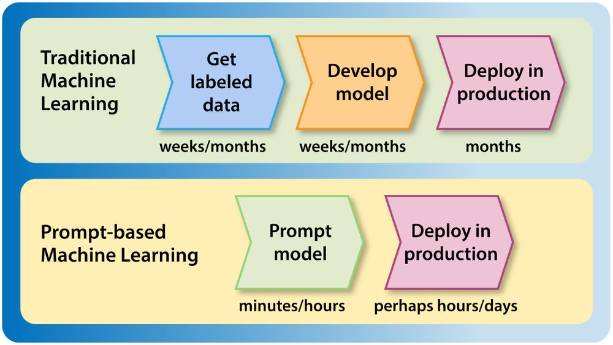

## ressources

- [State of GPT](https://www.youtube.com/watch?v=bZQun8Y4L2A) - Learn about the training pipeline of GPT assistants like ChatGPT

## Un peu de vocabulaire

- **completion** : l'output des LLMs est appelé `completion`, il s'agit de la réponse qu'on obtient en injectant un prompt dans un LLMs.
- **inference** : l`inference` est l'action d'utiliser un LLMs pour générer une completion.

## Les risques des LLM

- [[llm.hallucination]]
- [[llm.biais]]
- [[llm.consent]]
- [[llm.security]]

## Un nouveau “pipeline” de développement

- Pour @ngGoogleGoesAllIn2023, les _LLM_ apportent de nouvelles étapes dans le développement des projets de [[machine learning|machine-learning]] :
- utiliser un _prompt_ pour développer un modèle (~ mintes à heures)
- passer le modèle en production sur des données de production en « shadow mode », c’est-à-dire que les prédictions sont mesurées et évaluées mais elles ne sont pas utilisées,
- si les performances sont bonnes, on peut utiliser le modèle,
- si on veut améliorer les performances (optionel), on collecte un data test afin de comparer l’optimisation des paramètre [[ds.ml.hypertuning]]
  
- Attention cependant aux cas d’utilisation avec les données sensibles :
- médical
- justice
- protection social
- etc.
  id:: 087f8ebb-7fa5-4eb9-abf4-c5e160ca2592

  Il et important d’évaluer avec précision les inférences du modèle pour éviter
  des biais.

- ## Les modèles
- ### Open AI
- ### Meta AI
  - [[Llama]]
- ### Google
  - PaLM
  - Bert
- https://falconllm.tii.ae/

  https://openai.com/blog/chatgpt
  https://openai.com/research/gpt-4
  https://openai.com/research/dall-e

  foundational llm ??

  65-billion parameter ?? what parameter ???

  bigscience/bloom : https://huggingface.co/bigscience/bloom

  google : model : LaMDA (https://blog.google/technology/ai/lamda/) / chatbot : BARD (https://blog.google/technology/ai/bard-google-ai-search-updates/)

  standford alpaca : https://crfm.stanford.edu/2023/03/13/alpaca.html

  https://huggingface.co/google/flan-ul2

  Gato : https://www.deepmind.com/blog/a-generalist-agent

  Google : PaLM : https://ai.googleblog.com/2022/04/pathways-language-model-palm-scaling-to.html

  Anthropic / claude : https://www.anthropic.com/index/introducing-claude

  https://www.deepmind.com/blog/language-modelling-at-scale-gopher-ethical-considerations-and-retrieval
  https://ai.googleblog.com/2021/12/more-efficient-in-context-learning-with.html
  chincilla : https://arxiv.org/abs/2203.15556

  https://github.com/eugeneyan/open-llms
  https://en.wikipedia.org/wiki/Large_language_model

- gpt
- berta

Pour @ngGoogleGoesAllIn2023, les _LLM_ apportent de nouvelles étapes dans le développement des projets de [[machine learning|machine-learning]] :

1. utiliser un _prompt_ pour développer un modèle (~ mintes à heures),
2. passer le modèle en production sur des données de production en « shadow mode », c’est-à-dire que les prédictions sont mesurées et évaluées mais elles ne sont pas utilisées,
3. si les performances sont bonnes, on peut utiliser le modèle,
4. si on veut améliorer les performances (optionel), on collecte un data test afin de comparer l’optimisation des paramètre [[ds.ml.hypertuning]]

Attention cependant aux cas d’utilisation avec les données sensibles :

- médical
- justice
- protection social
- etc.

Il et important d’évaluer avec précision les inférences du modèle pour éviter
des biais.

:PROPERTIES:
:ID: 087f8ebb-7fa5-4eb9-abf4-c5e160ca2592
:END:
#+title: large language model (LLM)

- LLM

https://falconllm.tii.ae/

https://openai.com/blog/chatgpt
https://openai.com/research/gpt-4
https://openai.com/research/dall-e

foundational llm ??

65-billion parameter ?? what parameter ???

llama : https://github.com/facebookresearch/llama

bigscience/bloom : https://huggingface.co/bigscience/bloom

google : model : LaMDA (https://blog.google/technology/ai/lamda/) / chatbot : BARD (https://blog.google/technology/ai/bard-google-ai-search-updates/)

standford alpaca : https://crfm.stanford.edu/2023/03/13/alpaca.html

https://huggingface.co/google/flan-ul2

Gato : https://www.deepmind.com/blog/a-generalist-agent

Google : PaLM : https://ai.googleblog.com/2022/04/pathways-language-model-palm-scaling-to.html

Anthropic / claude : https://www.anthropic.com/index/introducing-claude

https://www.deepmind.com/blog/language-modelling-at-scale-gopher-ethical-considerations-and-retrieval
https://ai.googleblog.com/2021/12/more-efficient-in-context-learning-with.html
chincilla : https://arxiv.org/abs/2203.15556

https://github.com/eugeneyan/open-llms
https://en.wikipedia.org/wiki/Large_language_model

### Farid presentation

- Evolution constante du NLP depuis 1980.
- Le **mécanisme d'attention** (2015) et l’**architecture Transformers** (2017) ont révolutionné le domaine du traitement automatique du langage (NLP)
  - « Neural Machine Translation by Jointly Learning to Align and Translate » par Bahdanau et al (Université de Montréal et Bremen) - 2015
  - « Attention is All you Need », par Vaswani et al. (Google Research) - 2017

--- POURQUOI CETTE COURSE AU GIGANTISME ?

Un modèle de langage se caractérise par 4 éléments :

- Nombre de paramètres du réseau de neurones
- Taille de l’ensemble de données d'entraînement (data set)
- Temps/puissance de calcul utilisé pour l'entraîner (en FLOP)
- L'architecture du réseau de neurones (Transformers…)

Lois de mise à l'échelle des modèles de langage (scaling laws for LLM)

1. Augmenter le nombre de paramètres est **3 fois plus important** qu’augmenter la taille de l'ensemble d'entraînement. OpenAI, (Kaplan et al., 2020)
2. Augmenter la taille des données d'entraînement est tout aussi important. **Ils doivent être augmentés dans des proportions égales**. DeepMind, (Hoffman et al., 2022)
3. Travaux plus récents (Chinchilla) : GPT3 à 1,3 Mds de param. + RLHF équivaut à GPT3 à 173 Mds de param.

Une propriété étonnante des LLMs est l’émergence de nouvelles capacités à mesure que la taille du réseau augmente.
<diagrame avec des llm de plus en plus en gros + nouvelles capacités> = EMERGENCE

--- Hallucination

A multitask, multilanguage, multimodal evaluation of chatGPT, on reasoning, halluciantion and interactivity

… we find that ChatGPT is 63.41% accurate on average in 10 different reasoning categories under logical reasoning, non-textual reasoning, and commonsense reasoning, hencemaking it an
unreliable reasoner. It is, for example, better at deductive than inductive reasoning. ChatGPT suffers from hallucination problems like other LLMs and it generates more extrinsic hallucinations from its parametric
memory as it does not have access to an external knowledge base …
