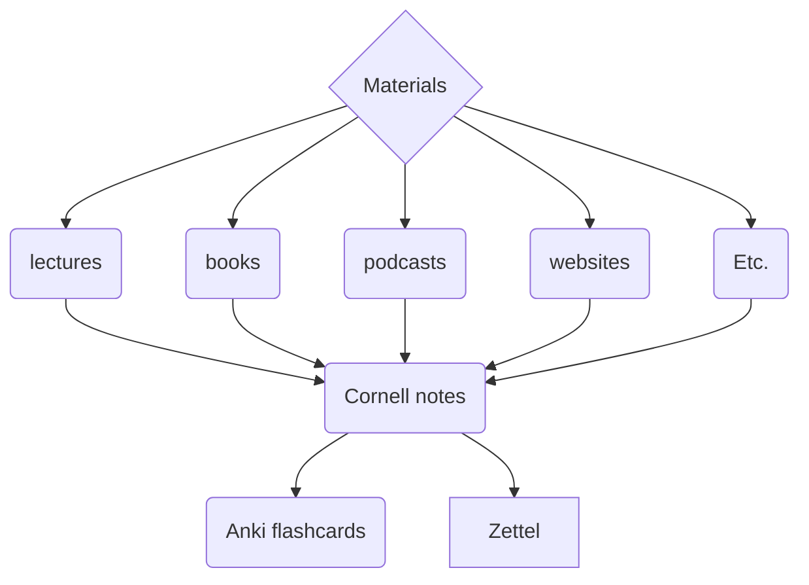
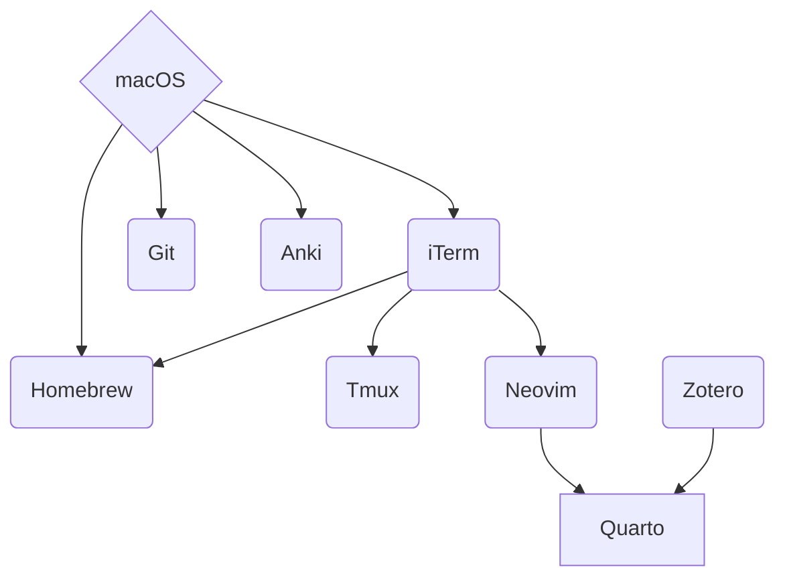
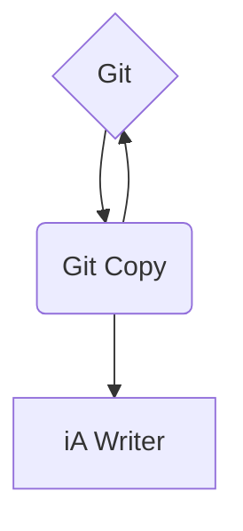

## Workflow

- rédaction de [[notes permanentes|zettelkasten.note]] avec [[vscode.dendron]] tout àe ouvrant un fichier `qmd` du répertoire ~/website

- git `~/.config`
  - zsh
  - oh-my-zsh
  - neocim
  - guillaume/library/code/...

## Space repitions

- [[vscode]]
- [[anki]]
- [[anki-connect]] https://foosoft.net/projects/anki-connect/

## Zettel

- [[vscode.dendron]]
- [[zotero]] + citatiokn picker
- [[quarto]] + incorporate zotero with dendron

## website

- [[quarto.website]]
- [[github]]
- [[posse]]

## python

guillaume@skekCoon-laptop:~$ sudo apt-get install python3 python3-dev
Reading package lists... Done
Building dependency tree... Done
Reading state information... Done
python3 is already the newest version (3.11.2-1+b1).
python3 set to manually installed.
The following additional packages will be installed:
libc-dev-bin libc-devtools libc6-dev libcrypt-dev libexpat1-dev libjs-jquery libjs-sphinxdoc libjs-underscore
libnsl-dev libpython3-dev libpython3.11-dev libtirpc-dev linux-libc-dev manpages-dev python3-distutils python3-lib2to3
python3.11-dev rpcsvc-proto zlib1g-dev
Suggested packages:
glibc-doc
The following NEW packages will be installed:
libc-dev-bin libc-devtools libc6-dev libcrypt-dev libexpat1-dev libjs-jquery libjs-sphinxdoc libjs-underscore
libnsl-dev libpython3-dev libpython3.11-dev libtirpc-dev linux-libc-dev manpages-dev python3-dev python3-distutils
python3-lib2to3 python3.11-dev rpcsvc-proto zlib1g-dev
0 upgraded, 20 newly installed, 0 to remove and 0 not upgraded.
Need to get 13.6 MB of archives.
After this operation, 56.5 MB of additional disk space will be used.
Do you want to continue? [Y/n] Y

## neovim

guillaume@skekCoon-laptop:~$ sudo apt-get install neovim
[sudo] password for guillaume:
Reading package lists... Done
Building dependency tree... Done
Reading state information... Done
The following additional packages will be installed:
libluajit-5.1-2 libluajit-5.1-common libmsgpackc2 libtermkey1 libtree-sitter0 libunibilium4 libvterm0 lua-luv
neovim-runtime python3-greenlet python3-msgpack python3-pynvim xclip xxd
Suggested packages:
ctags vim-scripts python-greenlet-dev python-greenlet-doc
The following NEW packages will be installed:
libluajit-5.1-2 libluajit-5.1-common libmsgpackc2 libtermkey1 libtree-sitter0 libunibilium4 libvterm0 lua-luv neovim
neovim-runtime python3-greenlet python3-msgpack python3-pynvim xclip xxd
0 upgraded, 15 newly installed, 0 to remove and 0 not upgraded.
Need to get 6,646 kB of archives.
After this operation, 28.7 MB of additional disk space will be used.
Do you want to continue? [Y/n] Y

### additional packages

guillaume@skekCoon-laptop:~$ sudo apt-get install vim-scripts python-greenlet-dev python-greenlet-doc
Reading package lists... Done
Building dependency tree... Done
Reading state information... Done
Suggested packages:
perlsgml libtemplate-perl ctags
The following NEW packages will be installed:
python-greenlet-dev python-greenlet-doc vim-scripts
0 upgraded, 3 newly installed, 0 to remove and 0 not upgraded.
Need to get 751 kB of archives.
After this operation, 5,213 kB of additional disk space will be used.
Get:1 http://deb.debian.org/debian bookworm/main amd64 python-greenlet-dev amd64 2.0.2-1 [14.9 kB]
Get:2 http://deb.debian.org/debian bookworm/main amd64 python-greenlet-doc all 2.0.2-1 [67.9 kB]
Get:3 http://deb.debian.org/debian bookworm/main amd64 vim-scripts all 20210124.2 [669 kB]
Fetched 751 kB in 0s (2,292 kB/s)

## R

sudo apt update
sudo apt install r-base r-base-dev

## quarto

1. git
2. homebrew
3. python
4. r
   5, quarto
5. vscodium
   dendron
   quarto
   prettier

prompt

prompt
