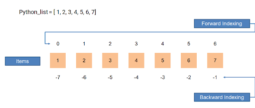
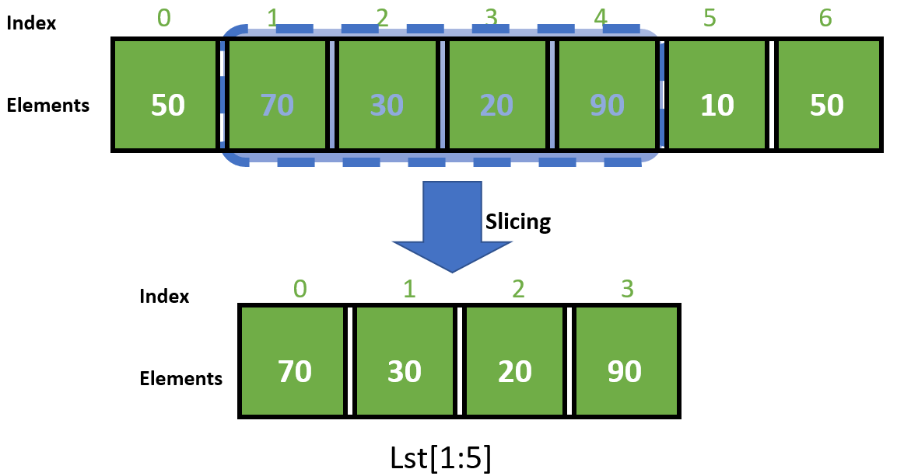

A [[python]] list is a [[data-structure]] representing ordered sequences of
values. Here is an example of how to create them:

```python
primes = [2, 3, 5, 7]
```

A list can hold different [[data-type]] and we can even create list of lists:

```python
family = [["Helen", 1.56],
          ["Jerry", 1.83],
          ["George", 1.74],
          ["Kramer", 1.89]]
```

## Indexing a list

You can access individual list elements with square brackets `[]`. Python uses
zero-based indexing, so the first element has index 0. Elements at the end of the
list can be accessed with negative numbers, starting from `-1`:

```python
prime[0]
>>> 2

prime[-1]
>>> 7
```



## Slicing

Slicing a list allow to values from within a list using indeces.

```python
prime[0:3]
>>> [2, 3, 5]
```

THe fist index, `0` is the beginning of the "slice" and it's included, but the
end of the slice, `3` is excluded. beginning or end are optional.

```python
prime[:3]
>>> [2, 3, 5]
```

```python
# All the planets except the first and last
prime[1:-1]
>>> [3, 5, 7]

# The last 3 planets
planets[-3:]
```



## Modifying a list

Lists are **mutable**, meaning they can be modified "in place".

```python
planets = ['Mercury', 'Venus', 'Earth', 'Mars', 'Jupiter', 'Saturn', 'Uranus', 'Neptune']
planets[3] = 'Malacandra'
planets
>>> ['Mercury', 'Venus', 'Earth', 'Malacandra', 'Jupiter', 'Saturn', 'Uranus', 'Neptune']
```

## List functions

Python has several useful functions for working with lists.

- [[python-len]]
- [[python-sorted]]
- [[python-sum]]
- [[python-min]]
- [[python-max]]

## List [[python-method]]

- [[python-append]]
- [[python-sort]]
- [[python-pop]] supprime et renvoie el dernier élément d’une liste
- [[python-index]] retourne l’index de l’argument
- `count()`, to get the number of times an element appears in a list ;
- `remove()`, that removes the first element of a list that matches the input ;
- `reverse()`, that reverses the order of the elements in the list it is called on ;

## Searching a list

We can use the [[python-operator]] `in` to determine whether a list contains a
particular value:

```python
# Is Earth a planet?
"Earth" in planets
>>> True
```

### references

- [@morrisLearnPythonKaggle]

[//begin]: # "Autogenerated link references for markdown compatibility"
[python]: python.md "Python"
[data-structure]: data-structure.md "Data Structure"
[python-len]: python-len.md "len() function in Python"
[python-sorted]: python-sorted.md "sorted() function python"
[python-method]: python-method.md "Python Method"
[python-append]: python-append.md "append()"
[python-sort]: python-sort.md "sort() method"
[//end]: # "Autogenerated link references"
