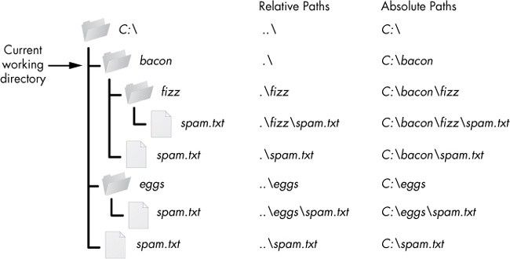

[Absolute paths](absolute-path.qmd) are useful, but they're not always efficient.
Suppose you're in `/var/log/foo` and you want to view a file in `/var/log/bar`.
There's no reason to "travel" all the way back to `/var`. Instead, use a
relative path to look outside of foo and into bar.

```{bash}
$ sudo cat ../bar/file.txt
```

Two dots `..` represent moving to a parent directory, so `../bar/file.txt` means
to move up one directory (into `/var/log`) and then descend into `/var/log/bar`,
which contains `file.txt`.

You may notice that using `..` isn't very descriptive. That's both the advantage
and disadvantage of a relative path. It's an advantage because it can be quicker
to type and it's flexible. The statement `../bar/file.txt` doesn't care what
comes before `bar`. It only knows that the bar directory contains a file called
`file.txt`. That makes it equally true whether a user keeps the `foo` and `bar`
directories in `/var/log` or in `/opt` or in `/home/tux/.var/log` or any other
location.

Relative paths allow applications and scripts to be largely self-contained. As
long as the immediate environment is predictable, you can always reference files
from a known location.


