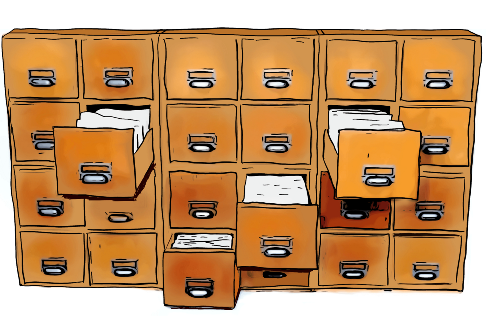

# Zettelkasten

In German, _zettelkasten_ means note box, a robust system for supporting large
numbers of notes. The first “brick” of the system consists of grouping the notes
by **main subjects** and **themes**. The relationships between subjects and
themes are not necessarily hierarchical, and there may be more or less linked
interactions.

A note can be inserted in several places in the system. This ambiguity is, in
reality, an opportunity for Niklas Luhmann because there is no ascending or
descending relationship between subjects and themes. That is, there is no
_privileged_ position for a note, so it can be positioned in different places,
because it is independent. [@ImprovedTranslationCommunications2023]

- [[zettelkasten.personal-knowledge-management]]

[//begin]: # "Autogenerated link references for markdown compatibility"
[zettelkasten.personal-knowledge-management]: notes/zettelkasten.personal-knowledge-management.md "Zettelkasten, un système de connaissance personnalisable"
[//end]: # "Autogenerated link references"
