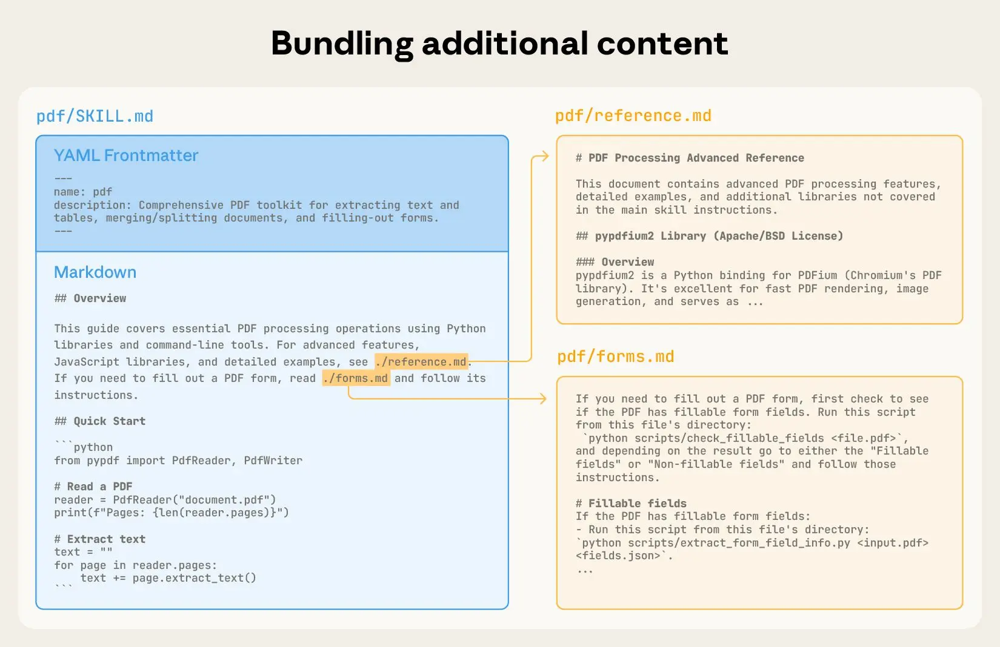
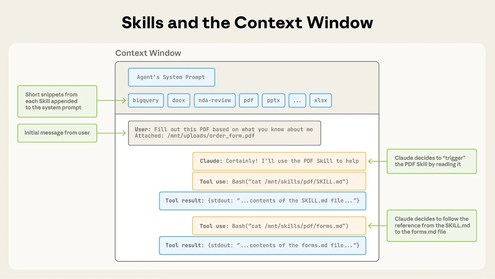
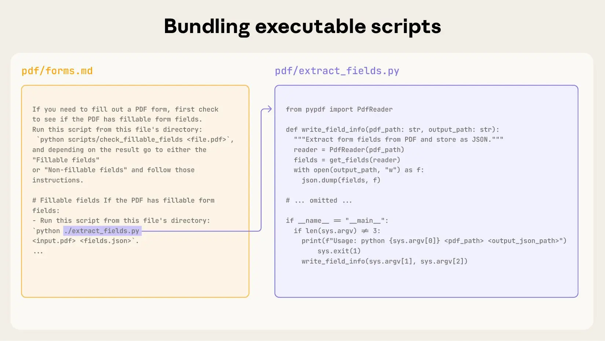

## 

Rather than embedding every piece of specialized knowledge into the system
prompt, skills allow the agent to remain a lightweight generalist that flexes
into specialist roles on demand through **progressive disclosure**:

1. The agent sees only lightweight metadata at startup
2. Loads full instructions when a task matches
3. Pulls deep reference material only when explicitly needed

Agent Skills solve four problems that have plagued AI agent development:

1. **Context rot** from overloaded prompts
2. **Absence of procedural memory** for LLMs
3. **Operational overhead** of multi-agent architectures
4. **Need for portability** across tools and vendors

## Why Agent Skills?

As model capabilities improve, we are moving from [vibe coding](./vibe-coding.qmd)
to general-purpose agents that interact with full-fledged computing environments.
Agents can accomplish complex tasks across domains using local code execution and
filesystems. But as these agents become more powerful, we need more composable,
scalable, and portable ways to equip them with domain-specific expertise.

[Anthropic introduces skills](https://www.anthropic.com/engineering/equipping-agents-for-the-real-world-with-agent-skills),
in octobre 2025, to solve this by packaging procedural knowledge and company-,
team-, and user-specific context into folders that agents load on demand. This
gives agents:

- **Domain expertise**: Capture specialized knowledge, from legal review processes
  to data analysis pipelines to presentation formatting, as reusable instructions
  and resources.
- **Repeatable workflows**: Turn multi-step tasks into consistent, auditable
  procedures.
- **Cross-product reuse**: Build a skill once and use it across any skills-compatible
  agent.

Two months later (in december 2025), Anthropic, released [Agents Skills](https://agentskills.io/home)
as **open standard**[^An open standard is a standard that is freely available for adoption, implementation and updates. A few famous examples of open standards are XML, SQL and HTML.]
for cross-platform portability to be adopted by a broader ecosystem.

Building a skill for an agent is like putting together an onboarding guide for a new
hire. Instead of building fragmented, custom-designed agents for each use case,
anyone can now specialize their agents with composable capabilities by capturing
and sharing their procedural knowledge.

## Where do they live ?

Skills are **folders** of instructions that agents can discover and each skill
lives in a `SKILL.md` file. *Personal* skills are store in `~/.claude/skills`
(your home directory) and follow you across all projects.

On the other hand, *project* related skills are stored in `.claude/skills` inside
the root directory of your repository. Anyone who clones the repo gets these
skills automatically. This is where team standards live, like your company's
brand guidelines, preferred fonts, and colors for web design.

::: {.callout-tips}
On Windows, personal skills live in `C:/Users/<your-user>/.claude/skills`.
:::


## Anatomy of Skills

### YAML Frontmatter

At its simplest, a skill is a directory that contains a `SKILL.md` file. This
file must start with YAML frontmatter that contains some required metadata:
`name` and `description`. At startup, the agent pre-loads the `name` and
`description` of every installed skill into its [system prompt](./prompt.qmd#system-prompt).

```markdown
---
title: pr-review
description: Reviews pull requests for code quality. Use when reviewing PRs or
checking code changes.
---

When reviewing code in this FastAPI projects, check for:

## Code quality
1. **Readibility and clear naming** - Variables, functions, and classes should
  have descriptives names.
2. **Consistent patterns** - Follow the existing router/schema/model patterns in
  the codebase

[...]
```

### Progressive Disclosure

This metadata is the **first level** of progressive disclosure: it provides just
enough information for agents to know when each skill should be used without
loading all of it into context.

The actual body of this file is the **second level** of detail. Agents compares
user requests against available skill descriptions and load the skill by reading
its full `SKILL.md` into context.

As skills grow in complexity, they may contain too much context to fit into a
single `SKILL.md`, or context that’s relevant only in specific scenarios. In
these cases, skills can bundle additional files within the skill directory and
reference them by name from `SKILL.md`. These additional linked files are the
**third level** (and beyond) of detail, which agents can choose to navigate and
discover only as needed.

### Example

In the PDF skill shown below, the `SKILL.md` refers to two additional files
(`reference.md` and `forms.md`) that the skill author chooses to bundle alongside
the core `SKILL.md`. By moving the form-filling instructions to a separate file
(`forms.md`), the skill author is able to keep the core of the skill lean,
trusting that agents will read `forms.md` only when filling out a form.



When agents matches a skill to your request, you'll see it load in the terminal:

```bash
🟢 Skill(pr-review)
   └── Successfully loaded skill 
```

## Context Window

**Progressive disclosure** is the core design principle that makes Agent Skills
flexible and scalable. Like a well-organized manual that starts with a table of
contents, then specific chapters, and finally a detailed appendix, skills let
agents load information only as needed into the [context window](./context-window.qmd):

| Level |               File                 | Context Window           | # Tokens              |
|-------|------------------------------------|--------------------------|-----------------------|
|   1   | `SKILL.md` YAML metadata           | Always loaded            | ~ 100                 |
|   2   | `SKILL.md` body                    | Load when skill triggers | < 5k                  |
|   3+  | Bundled files (text, script, data) | Loaded as-needed         | Effectively unlimited |

As user session progresses, context window grows in size: 

1. To start, the context window has the core system prompt and the metadata
  for each of the installed skills, along with the user’s initial message;
2. Agent triggers the PDF skill, for example, by invoking a Bash tool to read
  the contents of `pdf/SKILL.md`;
3. Claude chooses to read the `forms.md` file bundled with the skill;
4. Finally, agents proceeds with the user’s task now that it has loaded relevant
  instructions from the PDF skill.

The following diagram shows how the context window of Claude session changes
when a skill is triggered by a user’s message.



## Developing and evaluating skills

Some helpful guidelines and tips for getting started with building and testing
skills.

### Start with Evaluation

In order to identify specific gaps in agents’ capabilities you could run them on
representative tasks and observing where they struggle or require additional
context. Then build skills incrementally to address these shortcomings.

### Structure for scale

When the `SKILL.md` file becomes unwieldy, split its content into separate files
and reference them. If certain contexts are mutually exclusive or rarely used
together, keeping the paths separate will reduce the token usage.

Finally, code can serve as both executable tools and as documentation. It should
be clear whether agents should run scripts directly or read them into context as
reference.

### Think from agent’s perspective

Monitor how agents uses your skill in real scenarios and iterate based on
observations. Watch for unexpected trajectories or overreliance on certain
contexts. Pay special attention to the name and description of your skill. Agents
will use these when deciding whether to trigger the skill in response to its
current task.

### Iterate with agents

As you work on a task with agents, ask to capture its successful approaches and
common mistakes into reusable context and code within a skill. If it goes off
track when using a skill to complete a task, ask it to self-reflect on what went
wrong.

This process will help you discover what context agents actually needs, instead
of trying to anticipate it upfront.

::: {.callout-important}
## Security Considerations

Skills provide agents with new capabilities through instructions and code. While
this makes them powerful, it also means that malicious skills may introduce
vulnerabilities in the environment where they’re used or direct agents to
exfiltrate data and take unintended actions.

It is recommended to install skills only from trusted sources. When installing
a skill from a less-trusted source, thoroughly audit it before use. Start by
reading the contents of the files bundled in the skill to understand what it
does, paying particular attention to code dependencies and bundled resources
like images or scripts.

Similarly, pay attention to instructions or code within the skill that instruct
agents to connect to potentially untrusted external network sources.
:::

### Skills Library

- [Anthropic open-source skills](https://github.com/anthropics/skills)


- [GitHub Copilot supports Agent Skill - 2025-12-18](https://github.blog/changelog/2025-12-18-github-copilot-now-supports-agent-skills/)
- openAI : https://github.com/openai/skills/commits/main/?after=a8924c2a35cfa290458852c4fad17c9133054c2e+104


Ressources
- https://www.deeplearning.ai/short-courses/agent-skills-with-anthropic/


## Towards a repeatable and deterministic Agent

Skills can also include code for Claude to execute as tools at its discretion.

Large language models excel at many tasks, but certain operations are better suited for traditional code execution. For example, sorting a list via token generation is far more expensive than simply running a sorting algorithm. Beyond efficiency concerns, many applications require the deterministic reliability that only code can provide.

In our example, the PDF skill includes a pre-written Python script that reads a PDF and extracts all form fields. Claude can run this script without loading either the script or the PDF into context. And because code is deterministic, this workflow is consistent and repeatable.




## The Skills architecture
Skills run in a code execution environment where Claude has filesystem access, bash commands, and code execution capabilities. Think of it like this: Skills exist as directories on a virtual machine, and Claude interacts with them using the same bash commands you'd use to navigate files on your computer.


How Claude accesses Skill content:

When a Skill is triggered, Claude uses bash to read SKILL.md from the filesystem, bringing its instructions into the context window. If those instructions reference other files (like FORMS.md or a database schema), Claude reads those files too using additional bash commands. When instructions mention executable scripts, Claude runs them via bash and receives only the output (the script code itself never enters context).

What this architecture enables:

On-demand file access: Claude reads only the files needed for each specific task. A Skill can include dozens of reference files, but if your task only needs the sales schema, Claude loads just that one file. The rest remain on the filesystem consuming zero tokens.

Efficient script execution: When Claude runs `validate_form.py`, the script's code never loads into the context window. Only the script's output (like "Validation passed" or specific error messages) consumes tokens. This makes scripts far more efficient than having Claude generate equivalent code on the fly.

No practical limit on bundled content: Because files don't consume context until accessed, Skills can include comprehensive API documentation, large datasets, extensive examples, or any reference materials you need. There's no context penalty for bundled content that isn't used.

This filesystem-based model is what makes progressive disclosure work. Claude navigates your Skill like you'd reference specific sections of an onboarding guide, accessing exactly what each task requires.


## Layer 2 — Skills & Tool Definitions

Static instructions tell an agent *how to think*. Skills and tools tell it
*what it can do*. This is where you extend the agent beyond pure text generation.

### `skill.md` and the `.agent/` directory

Several frameworks (and an emerging cross-framework convention) use a `.agent/`
directory to house skill definitions. Each skill is documented in a Markdown
file and can reference the code that implements it.

```
.agent/
├── skill.md          # catalogue of all skills
├── skills/
│   ├── search.md     # skill: web search
│   └── summarise.md  # skill: document summarisation
└── tools/
    ├── search.py
    └── summarise.py
```

A `skill.md` entry describes the trigger, the expected inputs and outputs, and
any limitations:

```markdown
## Skill: Summarise document

**Trigger:** User uploads a file or provides a URL.
**Goal:** Produce a 3-bullet executive summary.

### Instructions
1. Extract the main text.
2. Identify the 3 most important claims.
3. Return them as a bullet list, each ≤ 25 words.

### Limitations
- PDF only; does not handle scanned images.
- Max 50 pages.
```

**When to use it:** When you are building a custom agent or documenting skills
for a team, especially in a multi-agent system where different specialists need
clear capability boundaries.

### Function calling — OpenAI

OpenAI's function-calling API lets you describe tools as JSON schemas. The
model decides when to call one and returns structured arguments you execute
in your own code.

```python
tools = [
    {
        "type": "function",
        "function": {
            "name": "get_stock_price",
            "description": "Get the current price for a stock ticker.",
            "parameters": {
                "type": "object",
                "properties": {
                    "ticker": {"type": "string", "description": "e.g. AAPL"}
                },
                "required": ["ticker"]
            }
        }
    }
]
```

The model returns `{"name": "get_stock_price", "arguments": {"ticker": "AAPL"}}`;
you call your real API and feed the result back.

→ [OpenAI — Function calling guide](https://platform.openai.com/docs/guides/function-calling)

### Tool use — Anthropic Claude

Claude uses the same concept under the name *tool use*. The schema is slightly
different but the mental model is identical: describe a tool, let the model
decide when to invoke it, execute it yourself, return the result.

```python
tools = [
    {
        "name": "get_stock_price",
        "description": "Returns the current price for a stock ticker.",
        "input_schema": {
            "type": "object",
            "properties": {
                "ticker": {"type": "string"}
            },
            "required": ["ticker"]
        }
    }
]
```

→ [Anthropic — Tool use documentation](https://docs.anthropic.com/en/docs/build-with-claude/tool-use/overview)

::: {.callout-note}
## The convergence pattern

Both OpenAI and Anthropic tool definitions follow JSON Schema. If you abstract
your tool registry behind a small adapter, the same tool implementation can be
exposed to both platforms with a thin translation layer.
:::