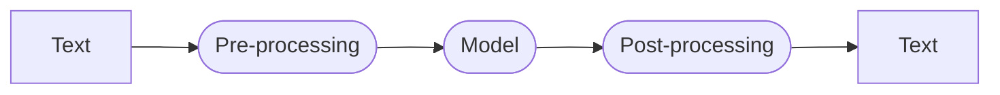

# `pipeline()`

`pipeline()` function is the most high level API of 🤗 Transformers library. It connects a model with its necessary preprocessing and post-processing steps. There is three main steps involved when you pass some text to `pipeline()`:
1. The text is processed into a format the model can understand, i.e. numbers.
2. The processed inputs are passed to the model.
3. The predictions of the model are post-processed to get back get intelligible (i.e. human readable) answers.



## Tasks

Tasks, or `pipeline()` types, describe the "_shape_" of each model's API, (i.e. inputs and outputs). `pipeline()` function support different modalities, such as text, audio, video, and even multi modal models.

### Text pipelines

#### Sentiment Analysis

`sentiment-analysis` task returns one of the two labels, `POSITIVE` or `NEGATIVE` with a `'score` representing the confident percentage of the returned label.

```python
from transformers import pipeline

classifier = pipeline("sentiment-analysis")
classifier("I've been waiting for a HuggingFace course my whole life.")
```

```python
>>> [{'label': 'POSITIVE', 'score': 0.9598047137260437}]
```

We can even pass several sentences inside a python's list:

```python
from transformers import pipeline

classifier = pipeline("sentiment-analysis")
classifier([
    "I've been waiting for a HuggingFace course my whole life.",
    "I hate this so much"
])
```

```python
>>> [{'label': 'POSITIVE', 'score': 0.9598047137260437},
     {'label': 'NEGATIVE', 'score': 0.9994558095932007}]
```

#### Zero-shot Classifier

`zero-shot-classifier` is a more elaborated `sentiment-analysis` classifier where it can takes several labels and return the percentage of each levels, so we don't have to rely on the labels of the pre-trained model. This _pipeline_ is called zero-shot because you don't need to fine-tune the model on our data. It can directly return probability scores of any list of labels we want.

```python
from transformers import pipeline

classifier = pipeline("zero-shot-classification")
classifier(
    "This is a course about Transformers library",
    candidate_labels = ["education", "politics", "business"]
)
```

```python
>>> {'sequence': 'This is a course about the Transformers library',
     'labels': ['education', 'business', 'politics'],
     'scores': [0.8445963859558105, 0.111976258456707, 0.043427448719739914]}
```

#### Text Generation

Generate text from a prompt

**Arguments**
- `num_return_sequences`:  control how many sequences are returned.
- `max_length`: total length of the output text.

```python
from transformers import pipeline

generator = pipeline("text-generation")
generator(
    "In this course, we will teach you how to",
    max_length = 30,
    num_return_sequences = 2)
```

```python
>>> [{'generated_text': 'In this course, we will teach you how to manipulate the world and '
                        'move your mental and physical capabilities to your advantage.'},
     {'generated_text': 'In this course, we will teach you how to become an expert and '
                        'practice realtime, and with a hands on experience on both real '
                        'time and real'}]
```

#### Mask Filling

`fill-mask` helps to fill in the blanks in a given text, where _mask token_ are positioned. By default, the _mask token_ is `<mask>`. Other models might have different _mask token_.

**arguments**
- `top_k`: controls how many possibilities we want to display.

```python
from transformers import pipeline

unmasker = pipeline("fill-mask")
unmasker("This course will teach you all about <mask> models.", top_k = 2)
```

```python
>>> [{'sequence': 'This course will teach you all about mathematical models.',
      'score': 0.19619831442832947,
      'token': 30412,
      'token_str': ' mathematical'},
     {'sequence': 'This course will teach you all about computational models.',
      'score': 0.04052725434303284,
      'token': 38163,
      'token_str': ' computational'}]
```

[Pipeline tutorial](https://huggingface.co/docs/transformers/v4.52.3/en/pipeline_tutorial)

It exist text-generation: Generate text from a prompt
text-classification: Classify text into predefined categories
summarization: Create a shorter version of a text while preserving key information
translation: Translate text from one language to another
zero-shot-classification: Classify text without prior training on specific labels
feature-extraction: Extract vector representations of text

### Image pipelines
image-to-text: Generate text descriptions of images
image-classification: Identify objects in an image
object-detection: Locate and identify objects in images

### Audio pipelines
automatic-speech-recognition: Convert speech to text
audio-classification: Classify audio into categories
text-to-speech: Convert text to spoken audio

### Multimodal pipelines
image-text-to-text: Respond to an image based on a text prompt

## Models

By default, `pipeline()` function select a particular pretrained model that has been fine-tuned for a specific task. The model is downloaded and cached when you call the `pipeline()` function. If you rerun the command, the cached model will be used instead and there is no need to download the model again.

However, we can use models avalaible on [HuggingFace Models Hub](https://huggingface.co/models) that are designed for specific task. For example, if we would like to use [SmolLM v2](https://huggingface.co/HuggingFaceTB/SmolLM2-360M) from HuggingFace:

```python
from transformers import pipeline

generator = pipeline("text-generation", model = "HuggingFaceTB/SmolLM2-360M")
generator(
    "In this course, we will teach you how to",
    max_length = 30,
    num_return_sequences = 2)
```

```python
>>> [{'generated_text': 'In this course, we will teach you how to manipulate the world and '
                        'move your mental and physical capabilities to your advantage.'},
     {'generated_text': 'In this course, we will teach you how to become an expert and '
                        'practice realtime, and with a hands on experience on both real '
                        'time and real'}]
```